# Design: Dynamic Strike Window Implementation

## Component: OptionChainBuilder
The `OptionChainBuilder` will be modified to support a dynamic filtering mechanism during the `_get_option_chain` process.

## Data Flow
1.  **Spot Capture**: `fetch_chain` retrieves the current SPY spot price.
2.  **Wide-Window Research (Batch)**: Occasionally (or on startup), retrieve quotes for a wide range of strikes (e.g., spot ± 70) to build a **Volume Distribution Map**.
3.  **Liquidity Analysis**: Analyze the map to find clustering of Volume/OI.
4.  **Active Window Filtering**: Calculate the narrow active window (e.g., spot ± 15 or adaptive) based on liquidity clusters.
5.  **Quote Request**: Longport `option_quote` is only called for the optimized subset.

## Interaction Diagram

```mermaid
sequenceDiagram
    participant Main as runner_loop
    participant OCB as OptionChainBuilder
    participant LP as Longport API

    Main->>OCB: fetch_chain()
    OCB->>LP: quote(["SPY.US"])
    LP-->>OCB: spot = 600.50
    
    rect rgb(30, 30, 40)
    Note right of OCB: Research Phase (e.g. Every 30 mins)
    OCB->>LP: option_quote(wide_window ± 70)
    LP-->>OCB: Full Volume Map
    Note over OCB: Determine "Hot Zone"
    end

    Note over OCB: Filter: hot_zone (informed by Volume Map)
    OCB->>LP: option_quote(hot_zone contracts ~ 30-50)
    LP-->>OCB: Quotes for Optimized Window
    OCB-->>Main: OptionChainSnapshot
```

## Storage Considerations
- This effectively "prunes" the GEX profile and ATM Decay tracking to the active trading zone.
- Redis baseline (OI) will still attempt to keep track of the day's start, but real-time updates will focus on the window.
