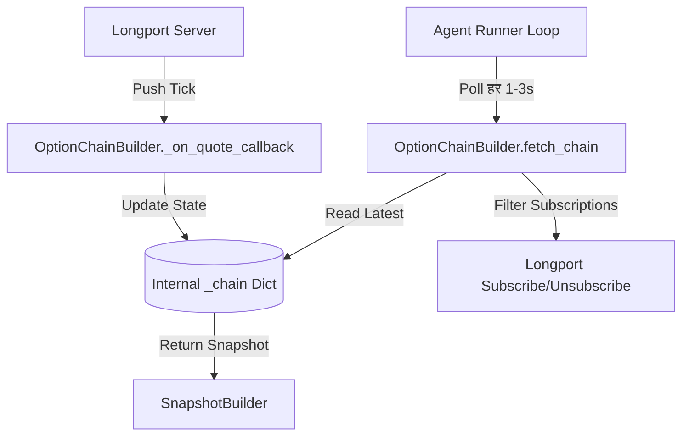

# Design: WebSocket Push-based Synchronization

## Data Flow

## Key Components

### 1. Subscription Manager
Responsible for maintaining the list of actively subscribed option symbols.
- **Input**: Current SPY Spot Price.
- **Logic**:
  - Calculate active strike range (Spot ± 15.0).
  - Find all Call/Put symbols for these strikes.
  - Diff against `self._subscribed_symbols`.
  - Issue `subscribe()` for additions and `unsubscribe()` for removals.

### 2. Push Callback Handler
- **Trigger**: Longport SDK background thread receives a quote update.
- **Action**:
  - Parse the `Quote` object (price, volume, last_done, etc.).
  - Map the symbol back to the internal `OptionData` structure.
  - Update fields in-place in `self._chain`.
  - Timestamp the update for stale checks.

### 3. State Fetching
- `fetch_chain()` becomes a lightweight "memory read" operation.
- No longer initiates `option_quote` REST calls unless the subscription is entirely empty.
