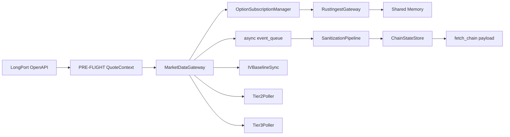

# L0 SOP — DATA FEED

> Version: 2026-03-07
> Layer: L0 Data Ingestion

## 1. Responsibility

L0 负责接入行情源、维持订阅、执行基础清洗和快照输出，是全链路唯一市场数据入口。

## 2. Architecture



## 3. Runtime Flow

1. PRE-FLIGHT 尝试初始化 `QuoteContext`。
2. 生命周期阶段 `MarketDataGateway.connect()` 捕获事件循环并注册回调。
3. 双栈订阅管理器驱动 Python/Rust 路径。
4. `ChainStateStore` 聚合并提供 `fetch_chain()` 快照。

## 4. Degraded Startup Contract

- PRE-FLIGHT 初始化失败: 必须降级为 `primary_ctx=None`，禁止崩溃。
- Gateway 二次建连失败: 必须保留服务可运行状态并输出 `feed paused` 诊断日志。

## 5. Output Contract (to L1)

`fetch_chain()` 最小字段要求:

- `spot`
- `chain`
- `version`
- `as_of_utc`
- `rust_active`
- `shm_stats: {status, head, tail}`

语义要求:

- `version` 单调递增，用于下游缓存失效
- `as_of_utc` 是链路主数据时间戳

## 6. Boundary Rules

- L0 不得依赖 L2/L3/L4。
- L0 对外仅暴露稳定数据契约，不泄漏内部实现细节。

## 7. Observability

建议关键日志:

- `[MarketDataGateway]`
- `[OptionChainBuilder]`
- `[IVSync]`

关键指标:

- `rust_active`
- `shm_stats`
- queue backlog / dropped count

## 8. Failure Handling

- 网络失败: 降级运行 + 明确日志
- REST 限频: governor cooldown
- SHM 不可用: `rust_active=false` 并保留 fallback

## 9. Verification

```powershell
powershell -ExecutionPolicy Bypass -File scripts/test/run_pytest.ps1 l0_ingest/tests
powershell -ExecutionPolicy Bypass -File scripts/test/run_pytest.ps1 scripts/test/test_l0_l4_pipeline.py
```
