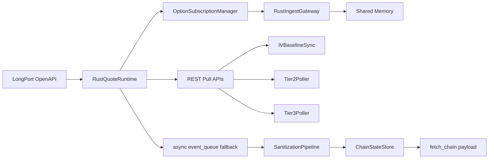

# L0 SOP — DATA FEED

> Version: 2026-03-10
> Layer: L0 Data Ingestion

## 1. Responsibility

L0 负责接入行情源、维持订阅、执行基础清洗和快照输出，是全链路唯一市场数据入口。

## 2. Architecture



## 3. Runtime Flow

1. 生命周期阶段构建 `L0QuoteRuntime`（默认 `rust_only`）。
   - `shared/config/api_credentials.py::longport_runtime_mode` 默认值为 `rust_only`。
2. `OptionSubscriptionManager` 通过 runtime 抽象触发 Rust 订阅与 REST 拉取。
 - 订阅池执行硬上限：`subscription_max` 会被运行时钳制到官方上限 `500`。
 - 超过上限时按离 spot 距离优先保留近端合约，输出 drop 诊断日志。
3. `ChainStateStore` 聚合并提供 `fetch_chain()` 快照。

## 3.1 官方网关与环境变量对齐（Rust SDK）

按 Longport Rust `Config::from_env` 契约，L0 默认应使用以下主网关：

- `https://openapi.longportapp.com`
- `wss://openapi-quote.longportapp.com/v2`
- `wss://openapi-trade.longportapp.com/v2`

运行时要求：

- 同时兼容 `LONGPORT_*` 与 `LONGBRIDGE_*` 两套环境变量名。
- 启动阶段必须将配置同步到两套别名，避免 Python/Rust bridge 读取键名不一致导致初始化失败。
- Rust runtime 必须维护端点候选序列（primary -> fallback），默认顺序：`longportapp -> longbridge`。
- 当 `socket/token` 建连出现 `client error (Connect)` 等网络类错误时，允许在未建立 WS 会话前切换后备端点并重试一次。

## 4. Degraded Startup Contract

- `longport_startup_strict_connectivity=true`（默认）时，启动阶段必须执行 `quote(["SPY.US"])` 连通性预检；两端点均失败时必须 fail-fast 中止启动。
- `longport_startup_strict_connectivity=false` 时，允许显式降级并输出结构化诊断（`endpoint_profile/endpoint_http_url/error`）。
- 降级模式下必须保持 L4 广播连续（空链 + 诊断），禁止静默停更。
- Rust REST pull 路径必须支持 `QuoteContext` 懒初始化（不依赖先 `start/subscribe`），
  防止冷启动阶段出现 `spot -> subscribe -> quote_ctx` 的闭环阻塞。

## 5. Output Contract (to L1)

`fetch_chain()` 最小字段要求:

- `spot`
- `chain`
- `version`
- `as_of_utc`
- `rust_active`
- `shm_stats: {status, head, tail}`

语义要求:

- `version` 单调递增，用于下游缓存失效
- `as_of_utc` 是链路主数据时间戳
- `fetch_chain()` 默认不得触发 legacy Greeks 重算；若确需兼容路径，必须显式传入 `include_legacy_greeks=true` 并记录调用来源（caller tag）
- `ttm_seconds` 必须持续输出（即使 legacy Greeks 关闭），不得影响下游 ActiveOptions/Presenter 契约

## 5.1 LongPort REST Runtime Contract

LongPort 期权 REST 契约在 `L0QuoteRuntime` 内统一对齐，当前只发生在 L0 runtime 边界，不自动进入 L1/L2/L3 计算链。

`option_quote()` 现保留官方期权行情字段，并统一返回同构对象：

- 顶层字段：`symbol`, `last_done`, `prev_close`, `open`, `high`, `low`, `timestamp`, `volume`, `turnover`, `trade_status`
- 兼容别名：`open_interest`, `implied_volatility`, `expiry_date`, `strike_price`, `contract_multiplier`, `contract_type`, `contract_size`, `direction`, `historical_volatility`, `underlying_symbol`
- nested 保真字段：`option_extend.{implied_volatility, open_interest, expiry_date, strike_price, contract_multiplier, contract_type, contract_size, direction, historical_volatility, underlying_symbol}`

`option_chain_info_by_date()` 现保留：

- `price`, `call_symbol`, `put_symbol`, `standard`
- 兼容语义别名：`strike_price`

`calc_indexes()` 现保留：

- `symbol`, `last_done`, `change_val`, `change_rate`, `volume`, `turnover`
- `expiry_date`, `strike_price`, `premium`
- `implied_volatility`, `open_interest`, `delta`, `gamma`, `theta`, `vega`, `rho`

研究/诊断透传规则：

- Tier2/Tier3 metadata 刷新阶段可保留 `standard`
- Tier2/Tier3 `calc_indexes()` 同次请求可保留 `premium`
- FeedOrchestrator 既有 `option_quote()` research 轮询可在不新增调用面的前提下聚合 `historical_volatility_decimal`
- 上述字段当前只允许进入 diagnostics / research 汇总，不得直接改写 L1 live compute 主合同

Raw + Normalized 规则：

- `*_raw`：保留官方原始字符串/原始表现，例如 `implied_volatility_raw`, `expiry_date_raw`
- `*_decimal`：明确为十进制比例，例如 `implied_volatility_decimal=0.2051`
- `*_iso`：明确为 `YYYY-MM-DD`，例如 `expiry_date_iso`

约束：

- L0 消费者应优先读取 `implied_volatility_decimal` 与 `expiry_date_iso`
- 旧字段继续保留用于兼容现有调用方，不允许在本轮替换式改名
- 本轮不修改 `fetch_chain()`、SHM schema、`CleanQuoteEvent` / `EnrichedSnapshot` 契约

## 6. Boundary Rules

- L0 不得依赖 L2/L3/L4。
- L0 对外仅暴露稳定数据契约，不泄漏内部实现细节。

## 7. Observability

建议关键日志:

- `[RustQuoteRuntime]`
- `[OptionChainBuilder]`
- `[IVSync]`
- `Switching endpoint profile to '<name>' (http=<url>)`
- `Startup connectivity probe passed|failed ... profile=<name> endpoint=<url>`

关键指标:

- `rust_active`
- `shm_stats`
- queue backlog / dropped count

## 8. Failure Handling

- 网络失败:
  - strict 开启: 启动失败并显式报错
  - strict 关闭: 降级运行 + 明确日志
- REST 限频: governor cooldown
- 启动期限频保护:
  - Symbol governor 采用双阶段 profile:
    - `startup`: `startup_symbol_rate_per_min` / `startup_symbol_burst`（默认 180/min, burst 20）
    - `steady`: `steady_symbol_rate_per_min` / `steady_symbol_burst`（默认 240/min, burst 50）
  - 进入 steady 条件: Tier1 warm-up 完成且连续 120s 无 cooldown。
  - 任何 `301607` 触发 `trigger_cooldown(60s)` 时，limiter 必须强制回落到 startup profile。
  - IV warm-up 启用去重窗口，避免启动阶段重复全量 warm-up。
  - FeedOrchestrator 对重操作加节流:
    - subscription refresh 最小间隔 30s
    - 新 symbols warm-up 合并窗口 20s（批量 flush，避免 4-symbol 高频触发）
    - volume research 仅在 warm-up 完成后且 cooldown 连续稳定 120s 才允许首轮执行
  - warm-up / Tier2 / Tier3 / research 批次大小受 `limiter.max_symbol_weight` 约束，禁止单次请求权重超过 `symbol_burst`。
  - Tier2/Tier3 启动延后并受 cooldown 门控（Tier2 首次 180s，Tier3 首次 300s）。
  - Subscription metadata 请求使用 TTL 缓存（默认 30s）与独立权重（默认 5）降低分钟窗口冲击。
- 官方硬限制守卫:
  - Request rate 不得超过 `10 calls/s`（运行时 limiter 自动钳制配置）。
  - 并发请求不得超过 `5`（运行时 limiter 自动钳制配置）。
  - 同时订阅 symbol 不得超过 `500`（订阅池强制裁剪）。
  - 默认速率配置与官方上限对齐：`longport_api_rate_limit=10`、`longport_api_max_concurrent=5`、`subscription_max=500`。
- SHM 不可用: `rust_active=false` 并保留 fallback
- 重复计算治理:
  - 禁止 `compute_loop` 与 `housekeeping_loop` 在同一 L0 `version` 上重复触发 legacy Greeks
  - 兼容 legacy 路径应提供按 `snapshot_version/caller` 的审计计数，便于定位重复算力消耗

## 8.1 Governor Telemetry Contract

`fetch_chain().governor_telemetry` 必须持续包含并向后兼容:

- `symbols_per_min`
- `cooldown_active`
- `limiter_profile` (`startup|steady`)
- `cooldown_hits_5m`
- `warmup_pending_symbols`
- `metadata_cache_hit_rate`

## 9. Verification

```powershell
powershell -ExecutionPolicy Bypass -File scripts/test/run_pytest.ps1 l0_ingest/tests
powershell -ExecutionPolicy Bypass -File scripts/test/run_pytest.ps1 scripts/test/test_l0_l4_pipeline.py
```
