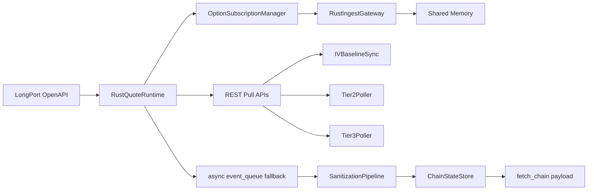

# L0 SOP — DATA FEED

> Version: 2026-03-09
> Layer: L0 Data Ingestion

## 1. Responsibility

L0 负责接入行情源、维持订阅、执行基础清洗和快照输出，是全链路唯一市场数据入口。

## 2. Architecture



## 3. Runtime Flow

1. 生命周期阶段构建 `L0QuoteRuntime`（默认 `rust_only`）。
   - `shared/config/api_credentials.py::longport_runtime_mode` 默认值为 `rust_only`。
2. `OptionSubscriptionManager` 通过 runtime 抽象触发 Rust 订阅与 REST 拉取。
 - 订阅池执行硬上限：`subscription_max` 会被运行时钳制到官方上限 `500`。
 - 超过上限时按离 spot 距离优先保留近端合约，输出 drop 诊断日志。
3. `ChainStateStore` 聚合并提供 `fetch_chain()` 快照。

## 4. Degraded Startup Contract

- Rust runtime 初始化失败: 必须显式降级并输出诊断，禁止进程崩溃。
- 降级时必须保持 L4 广播连续（空链 + 诊断），禁止静默停更。
- Rust REST pull 路径必须支持 `QuoteContext` 懒初始化（不依赖先 `start/subscribe`），
  防止冷启动阶段出现 `spot -> subscribe -> quote_ctx` 的闭环阻塞。

## 5. Output Contract (to L1)

`fetch_chain()` 最小字段要求:

- `spot`
- `chain`
- `version`
- `as_of_utc`
- `rust_active`
- `shm_stats: {status, head, tail}`

语义要求:

- `version` 单调递增，用于下游缓存失效
- `as_of_utc` 是链路主数据时间戳

## 6. Boundary Rules

- L0 不得依赖 L2/L3/L4。
- L0 对外仅暴露稳定数据契约，不泄漏内部实现细节。

## 7. Observability

建议关键日志:

- `[RustQuoteRuntime]`
- `[OptionChainBuilder]`
- `[IVSync]`

关键指标:

- `rust_active`
- `shm_stats`
- queue backlog / dropped count

## 8. Failure Handling

- 网络失败: 降级运行 + 明确日志
- REST 限频: governor cooldown
- 启动期限频保护:
  - IV warm-up 启用去重窗口，避免启动阶段重复全量 warm-up。
  - warm-up / Tier2 / Tier3 / research 批次大小受 `limiter.max_symbol_weight` 约束，禁止单次请求权重超过 `symbol_burst`。
  - Volume research 仅在 IV bootstrap 完成后触发，避免与 warm-up 并发冲击分钟额度。
- 官方硬限制守卫:
  - Request rate 不得超过 `10 calls/s`（运行时 limiter 自动钳制配置）。
  - 并发请求不得超过 `5`（运行时 limiter 自动钳制配置）。
  - 同时订阅 symbol 不得超过 `500`（订阅池强制裁剪）。
- SHM 不可用: `rust_active=false` 并保留 fallback

## 9. Verification

```powershell
powershell -ExecutionPolicy Bypass -File scripts/test/run_pytest.ps1 l0_ingest/tests
powershell -ExecutionPolicy Bypass -File scripts/test/run_pytest.ps1 scripts/test/test_l0_l4_pipeline.py
```
