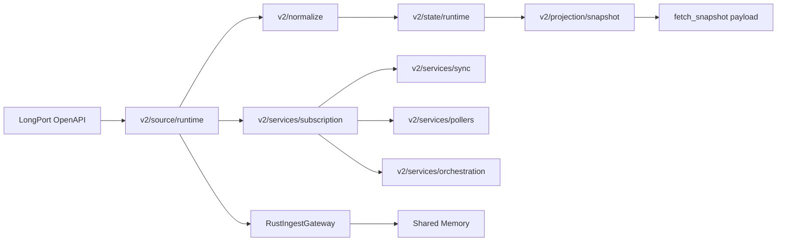

# L0 SOP — DATA FEED

> Version: 2026-03-10
> Layer: L0 Data Ingestion

## 1. Responsibility

L0 负责接入行情源、维持订阅、执行基础清洗和快照输出，是全链路唯一市场数据入口。

## 2. Architecture


```mermaid
flowchart LR
  A[LongPort OpenAPI] --> B[v2/source/runtime]
  B --> C[v2/normalize]
  C --> D[v2/state/runtime]
  D --> E[v2/projection/snapshot]
  B --> F[v2/services/subscription]
  F --> G[v2/services/sync]
  F --> H[v2/services/pollers]
  F --> I[v2/services/orchestration]
  B --> J[RustIngestGateway]
  J --> K[Shared Memory]
  E --> L[fetch_snapshot payload]
```

目录治理要求：

- `l0_ingest/v2` 是唯一正式运行树；禁止恢复 `l0_ingest/feeds/*` 平铺目录。
- `v2` 内部依赖固定为 `source -> normalize -> state -> services -> projection -> facade`。
- 顶层 `l0_ingest/` 仅允许保留稳定入口、基础中立目录与测试目录，禁止继续堆放新的业务编排文件。
- `v2/source/runtime/` 仅允许保留现役 runtime/provider 与其直接支撑模块；旧 shell 文件 `factory.py` / `openapi_bootstrap.py` / `quote_runtime.py` / `market_data_gateway.py` 已退出正式 runtime 树，禁止恢复。
- `v2/normalize/events/` 只允许保留当前 facade 实际消费的事件处理器；被替代的历史处理器必须移出或删除，禁止在正式运行树内并存。

## 3. Runtime Flow

1. 生命周期阶段只构建 Rust `L0QuoteRuntime`。
   - Python fallback runtime 已退出正式 L0 运行链。
2. `OptionSubscriptionManager` 通过 runtime 抽象触发 Rust 订阅与 REST 拉取。
 - 订阅池执行硬上限：`subscription_max` 会被运行时钳制到官方上限 `500`。
 - 首个有效 L0 source tick 前只允许 bootstrap 订阅刷新；首个有效 source tick 后前 600 秒使用 spot 附近 CALL/PUT 各 `±30` 行权价档位的 initial core。
  - 首个有效 source tick 满 600 秒后，订阅 core 切到 CALL/PUT 分边的当日累计 `volume` 最窄 90% 连续 strike 区间，并向外扩 `5` 档；若某一边没有可用 volume raw range，该边保持 initial core，另一边仍可进入 dynamic。
  - diagnostics 中全局 `phase` 只表示 600 秒主门槛是否已过；`call_phase` / `put_phase` 表示分边实际策略：`initial`、`dynamic` 或 `dynamic_guard_initial`。
 - 动态 core 不硬锁死：重平衡最多 60 秒一次；区间变化超过 2 档立即生效，小幅变化需要连续 2 次确认。
 - `SPY.US`、mandatory anchor legs、top OI、高 volume/current_volume 合约和近 spot 结构代理位作为 sentinel pool 始终参与目标集合；L0 禁止读取 L1/L2/L3 wall 字段来决定订阅。
  - 超过上限时按 protection tier、expiry、spot 距离和 symbol 稳定排序裁剪：mandatory/`SPY.US` 优先，其次近 spot 结构哨兵，再次 core range，最后 top OI/flow sentinel，输出 drop 诊断日志。
- `L0QuoteRuntime.subscribe()` 的输入语义是“当前应生效的完整 symbol 集”；运行时必须把该全集实际 reconcile 到活跃会话，禁止仅在 Python 侧更新 tracked symbols 而不下发到 Rust 会话。
- runtime diagnostics 应区分 `desired_symbols` 与 `applied_symbols`，`SubscriptionManager.subscribed_symbols` 只能反映已实际应用的集合。
- `SPY.US` 必须始终属于正式 live subscribe 集合，不能只存在于 startup probe 或运行中的 REST 补刷；顶层 `spot` owner 必须来自 live `SPY.US` depth top-of-book midpoint，而不是周期性 pull quote 或 `last_done` 兜底。
3. `ChainStateStore` 聚合并提供 `fetch_snapshot()` 快照。
4. L0 flow 字段所有权约束（ActiveOptions 关键）:
 - `DEPTH` 事件只允许更新价位簿价格（bid/ask），不得写入 `volume/current_volume/turnover`。
 - `QUOTE/TRADE` 事件可写入 flow 字段；`ws_*_seen` 仅在字段为正值时置位，避免 `0` 锁死 REST fallback。
 - 当某个 symbol 尚未收到任何有效 WS 价格（`bid/ask/last_price`）时，REST `option_quote` 允许临时回填价格字段；一旦该 symbol 出现有效 WS 价格，REST 不得再覆盖该 symbol 的价格所有权。
 - Anchor / mandatory symbols 若在 `calc_indexes()` 同步后仍无正价格字段，允许通过受限 `option_quote()` 追加一次价格修复；该修复必须复用共享 rate limiter，且仅面向小规模候选集，禁止退化为全链价格轮询。
 - 若启动时从持久化状态恢复出 ATM anchor，`lifespan` 必须在后台 loops 启动前先把该 anchor 两腿同步进 `mandatory_symbols`，避免首轮 warm-up / repair 因时序而看不到 anchor legs。
 - 若盘中冷启动刚完成 same-day bootstrap lock，`lifespan` 也必须在后台 loops 启动前把新锁定的 anchor 两腿同步进 `mandatory_symbols`，并执行一次有界 `option_quote()` repair；若修复命中正价格，应立即触发一次 ATM decay 重算，避免首个有效样本必须等待后续管理 tick。
 - 上述 startup anchor legs 同步进 `mandatory_symbols` 后，还必须立刻执行一次订阅刷新；禁止仅登记 mandatory 集合却等待后续 `FeedOrchestrator` cadence 才把 anchor 两腿纳入 `target_symbols`，否则盘中首个 ATM 样本可能长期看不到锁定腿。
 - 盘中 anchor 变化的主同步 owner 是 `compute_loop` 的 ATM update 路径：每次 `AtmDecayTracker` 产出新 anchor legs 时，app orchestration 必须通过 `OptionChainBuilder.set_mandatory_symbols()` 下发 mandatory 集合，并在 spot 有效时立即执行一次 `refresh_subscriptions_once()` 与有界 `repair_symbols_once()`；housekeeping 仅作为轻量兜底，禁止让 ActiveOptions strict hard-fail 成为 anchor mandatory 同步的单点故障。
 - WS `volume/current_volume` 必须通过可信上限校验（当前 hard cap: `1_000_000_000`）；超限值视为脏数据并丢弃，且不得置位 `ws_volume_seen/ws_current_volume_seen`（保留 REST fallback 接管能力）。
- HOT-START OI 预加载优先使用 `SubscriptionManager.symbol_to_strike`，但若启动早期映射尚未建立，允许按 option symbol 直接解析 strike 作为兜底，确保 disk OI 可在首批 live tick 前写入 `ChainStateStore`。
- `shared/cache/oi_snapshot.py` 是 OI baseline 持久化的中立 surface；`shared/system/persistent_oi_store.py` 已退役并删除，`IVBaselineSync` 与 `ActiveOptionsRuntimeService` 必须通过该 neutral surface 读写 disk OI baseline。
- `RustIngestGateway` 的实时推送主路径现已收敛到 Arrow IPC：
   - Rust hot path 只写 `${shm_path}_arrow` 共享段，批次合同由 Rust `ARROW_IPC_SCHEMA` 定义；legacy ring buffer 双写已退出热路径；
   - Arrow IPC signal 合同固定为 `L0_IPC_SIGNAL_NAME`；默认值跟随 Arrow 段名，即 `${shm_path}_arrow_signal`；
   - Rust `windows_signal.rs` 与 Python `shared/system/ipc_signal.py` 必须按 create-or-open 语义对齐同一个 Windows named event；
- Arrow IPC transport 必须是多槽有序队列，不得再使用“单槽 latest-message 覆盖”语义；writer 必须按单调 `batch_id` 追加，reader 必须按序 drain 未读批次，禁止用覆盖式 shared-memory payload 静默丢批次。
- transport diagnostics 必须至少暴露：`writer_batch_id`、`reader_last_batch_id`、`queued_batch_count`、`dropped_batch_count`、`reader_gap_count`；`queued_batch_count > 0` 或 `dropped_batch_count > 0` 视为 transport 退化证据。
- `shared/services/l0_runtime/source/runtime/ipc.py` 的 `ArrowIpcReader` 现为 live neutral surface；其 Rust owner 位于 `l0_ingest/l0_rust/src/ipc_runtime.rs`，并直接消费 `NativeArrowIpcReader`；
- `NativeArrowIpcReader.close()` 必须是可中断的不可变关闭语义：shutdown/restart 时允许与正在进行的 `read_next_payload()` 并存，并通过 named event 唤醒阻塞 wait；禁止再依赖 `&mut self` 关闭导致 PyO3 `Already borrowed` 终止 restart 路径。
- `shared/system/rust_shm_bridge.py` 与 `l1_compute/rust_bridge.py` 已退役并删除；旧 ring-buffer SHM 读取路径不再作为正式运行面，禁止恢复；
- `shared/services/l0_runtime/services/runtime/builder.py`（`OptionChainBuilder` owner）必须通过 `ArrowIpcReader` 消费 Arrow batch；Python event-queue fallback 已退出正式运行链；
  - Arrow 启动门禁为硬约束：必须先由 `SubscriptionManager` 完成首个有效订阅并创建 writer，再连接 `ArrowIpcReader`；
  - 若 `longport_subscription_ready_timeout_sec`（默认 60 秒）内仍未形成有效订阅，启动必须 fail-fast 中止，禁止继续进入读端重试循环；
- `shared/services/l0_runtime/normalize/bridges/__init__.py` 是 bridge 合同统一入口；market event parse、depth side shaping、trade payload direction 语义 source-of-truth 位于 `l0_ingest/l0_rust/src/l0_market_bridge.rs`；
- `shared/services/l0_runtime/services/runtime/arrow_events.py` 是 Arrow live event owner；Arrow 批次中的 `SPY.US` depth 必须先以 bid/ask midpoint 直写 `ChainStateStore.update_spot()`，再处理 option/depth/trade 分发，禁止再让快路径绕过 spot owner；
- trade callback payload 合同必须透传 `trade_type` 与 `trade_session`（来自 LongPort 推送），不得在 bridge 层硬编码为常量；
- trade callback 在 `price == midpoint` 场景必须执行 tick-rule（`prev_price` + `prev_direction`）判定方向，禁止输出模糊方向；
- `shared/services/l0_runtime/normalize/pipeline/__init__.py` 是清洗合同统一入口；QUOTE/DEPTH 基础清洗、IV/OI 归一化、crossed quote 防御与 top-of-book depth 提取语义 source-of-truth 位于 `l0_ingest/l0_rust/src/l0_sanitization.rs`；
- `shared/services/l0_runtime/normalize/events/__init__.py` 是 event processor 合同统一入口；SPY spot depth-midpoint 提取与 trade payload 归一化语义 source-of-truth 位于 `l0_ingest/l0_rust/src/l0_event_support.rs`；
- `shared/services/l0_runtime/state/runtime/__init__.py` 是 state owner 合同统一入口；entry 初始化、WS/REST flow owner merge、depth merge 语义 source-of-truth 位于 `l0_ingest/l0_rust/src/l0_state_support.rs`；
- `ChainStateStore` 必须同步维护 quote-lane cadence diagnostics：`last_source_timestamp_utc` / `last_source_gap_ms` / `source_event_count_1s/5s` 表示原始 `SPY.US` depth arrival cadence；`last_distinct_spot_timestamp_utc` / `last_distinct_spot_gap_ms` / `distinct_spot_count_1s/5s` 表示 midpoint 真变化 cadence。禁止再把“无新价变化”误判成“无 source event”。
- Option chain row 的 `last_update` / `last_update_utc` 必须随 QUOTE 与 DEPTH top-of-book 价格更新同步刷新；ATM decay 使用该 row-level 时间与 L0 source timestamp 校验 CALL/PUT 两腿 freshness，禁止用旧 bid/ask 伪装成同批次 ATM 样本。
- `l0_ingest/l0_rust/src/gateway_core.rs` 与 `l0_ingest/l0_rust/src/gateway_push_diag.rs` 必须暴露 `SPY.US` raw push telemetry：`raw_quote_event_count_1s/5s`、`raw_depth_event_count_1s/5s`、`last_raw_quote_gap_ms`、`last_raw_depth_gap_ms`。这些字段用于把“Longbridge 原始推送 cadence”与“Python spot owner 接受 cadence”拆开；禁止再用 Python 侧 `source_*` 指标冒充 gateway 原始到达频率。
- `shared/services/l0_runtime/projection/snapshot/__init__.py` 是 snapshot owner 合同统一入口；fallback snapshot、runtime-status、governor telemetry 与 fetch payload compose 语义 source-of-truth 位于 `l0_ingest/l0_rust/src/l0_projection.rs`；
   - `fetch_snapshot().shm_stats.head/tail` 在 Arrow 路径下保持原键名，但语义切换为 `writer_batch_id/reader_last_batch_id`，用于维持 L0→L4 诊断链连续并直接暴露读写差距；
   - `shared/system/rust_shm_bridge.py` 与 `shared/services/l0_runtime/normalize/bridges/rust_event_bridge.py` 现仅保留 deprecated compatibility wrapper；`rust_only` live path 不得再依赖它们；
   - `tests/l0_runtime/test_arrow_roundtrip.py` 必须覆盖 Rust producer -> Python `ArrowIpcReader` 的 batch roundtrip，验证 `batch_id`/`arrival_mono_ns`/schema 合同；
   - `SubFlags` 必须显式收敛到 `QUOTE|DEPTH|TRADE`，禁止使用 `SubFlags::all()` 引入无消费价值的额外流量。
- Arrow IPC writer 必须保持 safe-Rust 边界：批次构建与 `StreamWriter` 路径禁止出现 `unsafe`；必要的共享内存原始写入应封装在独立 transport 模块而非 writer 本体。
- 单个 Arrow slot 内的发布协议仍必须为原子可见序列：`len=0 -> payload bytes -> publish seq/len`；禁止先发布最终长度再写 payload（会导致读侧截断帧）。
- `OptionChainBuilder` 在 Arrow 读路径遇到可识别坏帧（`payload_empty/decode_failed/no_batch`）时必须走受控重连并保持消费循环存活，禁止单帧坏数据直接把 transport 永久锁死在全链路冻结状态。

### 3.3 IVBaselineSync 模块边界（P1 去混乱）

- `shared/services/l0_runtime/services/sync/__init__.py` 是 sync 合同统一入口；`shared/services/l0_runtime/services/sync/core.py` 仅保留 `IVBaselineSync` 生命周期/循环 owner。
- sync/repair helper owner 现已迁入 Rust native exports，由 `services/sync/__init__.py` 统一暴露：
  - subscription cap clamp
  - safe batch size
  - sync chunk split
  - IV/OI parse
  - rate-limit error detect
  - price-repair candidate selection
  - price-repair row apply summary
- Python 侧在该 cluster 中只允许保留 async runtime call、rate limiter acquire、logging 与 facade API，不得重新复制上述 helper 语义。
- `shared/services/l0_runtime/services/subscription/__init__.py` 是 subscription 合同统一入口；其稳定 helper owner 现部分迁入 Rust native exports：
  - official subscription cap clamp
  - option-chain row -> target symbol / strike-map collect
  - subscription pool cap trim / mandatory keep / strike-map filter
- Python 侧在 subscription cluster 中仍保留：
  - metadata TTL cache
  - async `option_chain_info_by_date()` 拉取
  - runtime `subscribe()` 调用
  - diagnostics/logging/public manager API
- `shared/services/l0_runtime/services/orchestration/__init__.py` 是 orchestration helper 合同统一入口；`shared/services/l0_runtime/services/orchestration/feed_orchestrator.py` 仅保留 `FeedOrchestrator` owner。
- orchestration helper owner 现已迁入 Rust native exports：
  - option symbol -> strike fallback parse
  - SHM u64 read helper
  - next-trading-day helper
  - positive-float / decimal-ratio normalize
  - valid average helper
  - nearest chain item selection
  - option IV decimal extraction
- Python 侧在 orchestration helper cluster 中仍保留：
  - `CleanQuoteEvent` 构造与 store mutation
  - async `.VIX` / `1DTE` quote fetch
  - limiter acquire
  - logging and public helper API
- `shared/services/l0_runtime/services/pollers/__init__.py` 是 poller 合同统一入口；共享 helper owner 现已迁入 Rust native exports：
  - option-chain metadata -> `symbol/strike/standard` map shaping
  - `calc_indexes()` row normalize
  - Top-N OI anchor retention
- `shared/services/l0_runtime/services/_native_helpers.py` 现为 services 层统一 native helper owner：
  - subscription helper exports
  - orchestration helper exports
  - poller helper exports
- `shared/services/l0_support/events/*`、`quality/*`、`sanitize/*`、`store/*` 已退出 Python owner 路径；live import surface 统一为 `shared_rust.services_l0_support`。
- `LongportFeedAdapter` 与 `tests/l0_support/*` 不得再导入 `shared.services.l0_support.events|quality|sanitize|store`；事件类型、清洗管道、质量报告和 MVCC store 的 source-of-truth 现位于 `shared_rust_l0_support/src/*`。
- `shared/services/l0_support/rate_governor/*` 与 `observability/*` 已退出 Python owner 路径；`AdaptiveRateGovernor`、`PriorityRequestQueue`、`RequestPriority`、`L0Instrumentation` 与 trace decorators 的 live import surface 统一为 `shared_rust.services_l0_support`。
- `tests/l0_support/test_adaptive_governor.py` 及任何后续 L0 support 消费者不得再导入 `shared.services.l0_support.rate_governor|observability`；governor/breaker/window 语义与 no-op instrumentation source-of-truth 现位于 `shared_rust_l0_support/src/governor.rs` 与 `observability.rs`。
- 小体量 Python thin wrappers `_native_subscription_support.py`、`_native_orchestration_support.py`、`pollers/_native_poller_support.py`、`pollers/shared.py`、`pollers/factory.py` 已退出正式运行树，禁止恢复分散 wrapper owner。
- Python 侧在 poller helper cluster 中仍保留：
  - expiry date scan / weekly selection
  - async `option_chain_info_by_date()` / `calc_indexes()` 拉取
  - limiter acquire
  - cache / diagnostics / logging / public poller API
- 行为契约保持不变：dedupe window、`301607` cooldown、ATM-first chunk 顺序、`spot_at_sync` 写入语义不变。
- `shared/services/l0_runtime/services/__init__.py` 是 services 根稳定 API 面；consumer 应通过 package entrypoints 导入 `RuntimeServices`、`FeedOrchestrator`、`apply_preloaded_oi_events`、`apply_rest_update`，不得再指向已删除的叶子模块路径。
- `shared/services/l0_runtime/source/runtime/__init__.py` 是 source/runtime 根稳定 API 面；consumer 应通过该入口导入 `APIRateLimiter`、`RuntimeBundle`、`build_runtime_bundle`、`L0QuoteRuntime`、`RustQuoteRuntime` 与 `_startup_connectivity_probe`，不得再导入已删除的 `rate_limiter.py` / `runtime_bundle.py` / `sdk_bootstrap.py`。
- `shared/services/l0_runtime/source/runtime/_native_helpers.py` 是 quote profile + quote REST contract native helper 统一 owner，替代 `_native_quote_api_support.py` / `_native_quote_profile_support.py`。
- `shared/services/l0_runtime/source/runtime/quote_runtime/{__init__.py,helpers.py}` 是 quote runtime owner surface；`contracts.py` / `shared.py` / `rust_runtime.py` 已退出正式运行树，禁止恢复分散 owner。
- `RustQuoteRuntime` 对单个 `RustIngestGateway` 拥有唯一并发所有权：所有 `start/stop/subscribe/unsubscribe/rest_*` 调用必须在 runtime owner 内串行化后再进入 PyO3/native gateway；禁止把同一个 gateway 当成可并发 `asyncio.to_thread(...)` 资源，否则会触发 PyO3 `Already borrowed`。
- `RustQuoteRuntime.diagnostics()` 不得直接读取 live `RustIngestGateway`；诊断面必须通过独立的 borrow-free diagnostics handle / cached snapshot 提供，避免诊断读与 live gateway owner 竞争，且避免因长耗时 native 调用而阻塞排障视图。

### 3.4 Metadata / Normalization Single Source

- `SanitizationPipeline` 是 L0 字段规范化唯一 source-of-truth：IV 百分比/小数归一、OI 数值清洗、REST/WS 价量字段清洗必须从同一实现导出。
- `SanitizationPipeline` 的 live parse owner 已迁入 Rust native exports；Python 侧只允许保留 dataclass/result facade，不得重新复制 quote/depth 清洗分支。
- `ChainEventProcessor` / `StateEventProcessor` 的 SPY spot depth-midpoint 提取与 trade callback payload 归一化已迁入 Rust native exports；Python 侧只允许保留 store/depth callback 编排，不得重新定义 trade direction/volume/timestamp 归一化逻辑。
- `shared/services/l0_runtime/source/runtime/quote_runtime/__init__.py` 的 `RustQuoteRuntime.subscribe()` 必须把 live symbol 集合真实 reconcile 到 Rust gateway；禁止保留“只在 Python 侧更新 tracked symbols”但不下发新增/删除订阅的伪同步路径。
- `ChainStateStore` 的 entry default、WS/REST owner merge、depth merge 语义已迁入 Rust native exports；Python 侧只允许保留版本号、日志、datetime 打点和公开对象 API，不得重新复制 flow ownership 判定分支。
- Tier1 warm-up、Tier2/Tier3 poller、startup OI preload、price repair 回填不得各自复制 IV/OI 解析逻辑；兼容 wrapper 只能委托到统一规范化实现。
- 到期日扫描与 `symbol -> strike/standard` metadata 构建必须走共享 resolver，禁止 `SubscriptionManager`、Tier2、Tier3 各自维护独立扫描逻辑。
- symbol strike fallback 解析必须走共享 helper，禁止在运行路径中继续硬编码 `symbol[10:]` 这类切片推断。

## 3.1 官方网关与环境变量对齐（Rust SDK）

按 Longport Rust runtime 契约，L0 默认应使用以下主网关：

- `https://openapi.longportapp.com`
- `wss://openapi-quote.longportapp.com/v2`
- `wss://openapi-trade.longportapp.com/v2`

运行时要求：

- 同时兼容 `LONGPORT_*` 与 `LONGBRIDGE_*` 两套环境变量名作为配置输入。
- 正式运行链不再依赖 Python env bridge；配置必须直接进入 Rust runtime owner。
- Rust runtime 可以维护端点候选序列用于配置，但运行态禁止自动切端点/重试；active profile 固定为当前配置项，连接失败必须显式抛错。
- 当 `socket/token` 建连出现 `client error (Connect)` 等网络类错误时，禁止 runtime 内部 failover；故障由启动门禁或上层编排显式处理。
- 若故障发生在运行中（WS 会话已建立），禁止执行 `stop -> 切端点 -> 重建 gateway -> 重订阅` 自愈链；必须保留失败现场并上抛。
- `RustQuoteRuntime.diagnostics()` 保留 `endpoint_profile`、`endpoint_http_url` 等当前端点信息；`failover_count`、`last_failover_error`、`last_failover_at_utc` 已退出合同。
- `QuoteContext` 生命周期、订阅以及 callback fan-in 必须全部由 Rust owner 负责；Python 不得再持有 `QuoteContext` 或 callback queue owner。
- Python 对生成扩展的消费必须直连 `shared.services.l0_runtime._native_generated.l0_rust`；`shared/services/l0_runtime/l0_rust.py` shim 已退出主路径。
- `shared.contracts.*` Python contract wrappers 已退出仓库；中立 contract import 面现统一为 `shared_rust.contracts`，contract source-of-truth 位于 `shared_rust/src/*`。
- `shared/services/l0_runtime/contracts/models.py` (`CallbackHooks` / `SnapshotRequest`) 已退出 Python owner 路径；`shared/services/l0_runtime/services/runtime/builder.py` 必须直接消费 `shared_rust.contracts.CallbackHooks` 与 `shared_rust.contracts.SnapshotRequest`。
- LongPort Quote REST contract normalize 与 endpoint/profile 构建现为 Rust-backed owner：
  - `quote_api_build_option_quote_contract` / `quote_api_build_option_chain_strike_contract` / `quote_api_build_calc_index_contract`
  - `quote_api_build_endpoint_profiles` / `quote_api_build_gateway_config`
  - source-of-truth 位于 `l0_ingest/l0_rust/src/quote_contract_support.rs` 与 `quote_profile_support.rs`
- `RustQuoteRuntime` 的 quote REST 调用面现优先消费 Rust row-contract exports：
  - `quote_api_rest_quote_rows`
  - `quote_api_rest_option_quote_contracts`
  - `quote_api_rest_option_chain_info_by_date_contracts`
  - `quote_api_rest_calc_indexes_contracts`
  - source-of-truth 位于 `l0_ingest/l0_rust/src/gateway_rest.rs`

## 4. Hard-Fail Startup Contract

- 启动阶段必须执行 `quote(["SPY.US"])` 连通性预检，并将返回的首个有效 `last_done` 作为首轮订阅建图的 bootstrap spot；该 probe 只用于启动门禁和首轮订阅，不得充当运行时 spot owner。
- `longport_startup_strict_connectivity=false` 为禁用配置：必须直接抛错并阻止进程启动。
- 禁止 degraded 启动与 fallback 广播；连接失败时不进入运行态。
- Rust REST pull 路径必须支持 `QuoteContext` 懒初始化（不依赖先 `start/subscribe`），
  防止冷启动阶段出现 `spot -> subscribe -> quote_ctx` 的闭环阻塞。
- `FeedOrchestrator` 禁止继续用 `quote(["SPY.US"])` 作为运行中的 spot 刷新兜底；若 live spot 缺失，必须显式等待已订阅的 `SPY.US` depth midpoint，而不是退回周期性 REST spot owner。
- `FeedOrchestrator` 的 live spot freshness gate 必须以 raw `SPY.US` source arrival 时间为准（`quote_lane.last_source_timestamp_utc`），不得以“midpoint 是否变化”或 `last_spot_update` 判 stale；flat-price 连续 raw tick 仍视为 fresh。
- 当 raw source age 超过 `10s` 时，`FeedOrchestrator` 必须显式进入 stale fast-fail：记录诊断日志，并跳过 header volatility aux refresh、strike subscription refresh 与 15-minute volume research；禁止继续拿缓存旧 `spot` 推进这些调度。

## 5. Output Contract (to L1)

`fetch_snapshot()` 最小字段要求:

- `spot`
- `chain`
- `version`
- `as_of_utc`
- `rust_active`
- `shm_stats: {status, head, tail}`

语义要求:

- `version` 单调递增，用于下游缓存失效
- `as_of_utc` 是链路主数据时间戳，必须绑定最近一次有效 L0 source update，而不是 `fetch_snapshot()` 投影时刻
- fallback 快照（`uninitialized` / `error`）也必须稳定输出 `rust_active`、`rust_shm_path` 与 `shm_stats`：
  - `uninitialized`: `rust_active=false`, `shm_stats.status=UNINITIALIZED`
  - `error`: `rust_active=false`, `shm_stats.status=ERROR`
- `fetch_snapshot()` 只负责 L0 原始快照与诊断投影，禁止在 L0 内补算 legacy Greeks / TTM 兼容字段
- `fetch_snapshot(include_chain_arrow=true)` 允许为 L1 compute 快路径附带内部字段 `chain_arrow`（`RecordBatch`）；该字段仅供进程内 L0->L1 使用，不作为外部 API 稳定合同
- `app/loops/compute_loop.py` 在构建 ActiveOptions 输入时必须直接传递 `EnrichedSnapshot` 到 `build_active_options_input_snapshot`，禁止先降格为 legacy dict（否则会丢失 `computed_gamma/computed_vanna` 与 `atm_iv`，触发伪降级）。
- `aggregate_greeks` 与 `ttm_seconds` 不再属于 L0 输出合同；若下游需要，必须由 L1 或 shared 中立服务产出
- `header_volatility_aux_diagnostics` 允许作为 L0 低频辅助诊断字段透传，当前用于标题栏波动上下文：
  - `.VIX.US` 归一化 `vix_iv_decimal`
  - `1DTE` 最近 ATM 合约 `atm_iv_1dte`
  - `next_expiry`
- ActiveOptions runtime 采用 strict no-fallback 合同：标准化输入链为空、引擎输出为空或输入无效时必须硬失败并进入 halted 状态，禁止生成补位/合成 fallback 行。
- 当 halted 原因是开盘暖机期 `engine_empty_output` / `normalized_chain_empty_no_candidates`，且后续 tick 首次恢复到存在真实当日成交量（`volume > 0`）的输入时，runtime MAY 自动 re-arm 并重新计算；禁止靠 synthetic fallback 行解锁。
- ActiveOptions `VOL` 口径必须使用当日累计成交量（`volume`）作为唯一排序字段；禁止以 `current_volume` 替代、补位或兜底。
- ActiveOptions 候选池必须严格围绕 `spot` 按固定窗口过滤（`flow_active_spot_window_steps`，默认 `±7` 档）；超窗合约即使 `volume` 更高也不得进入 Top 榜单。
- `housekeeping_loop` 启动竞态守卫：当 `latest_active_options_input` 尚未发布（`missing_input`）时必须记录显式告警并等待下一 tick，禁止因首 tick 缺输入直接终止 housekeeping 任务；一旦输入对象存在但 `valid=false`，仍按 strict 合同硬失败。
- `compute_loop` 在发布 `latest_active_options_input` 后必须在同一 `snapshot_version` tick 内确保 ActiveOptions 已更新到同版本（source-version aligned）再组装 payload；禁止仅依赖 housekeeping 异步节奏导致 UI Top 榜单滞后。
- ActiveOptions 行合同不再包含 fallback 语义字段：`fallback_reason`、`is_synthetic_fallback` 已移除。

## 5.1 LongPort REST Runtime Contract

LongPort 期权 REST 契约在 `L0QuoteRuntime` 内统一对齐，当前只发生在 L0 runtime 边界，不自动进入 L1/L2/L3 计算链。

`option_quote()` 现保留官方期权行情字段，并统一返回同构对象：

- 顶层字段：`symbol`, `last_done`, `prev_close`, `open`, `high`, `low`, `timestamp`, `volume`, `turnover`, `trade_status`
- 兼容别名：`open_interest`, `implied_volatility`, `expiry_date`, `strike_price`, `contract_multiplier`, `contract_type`, `contract_size`, `direction`, `historical_volatility`, `underlying_symbol`
- nested 保真字段：`option_extend.{implied_volatility, open_interest, expiry_date, strike_price, contract_multiplier, contract_type, contract_size, direction, historical_volatility, underlying_symbol}`
- 归一化 owner 现位于 Rust native contract builder；Python 仅保留 dataclass facade，不得重新复制 expiry/IV/strike 归一化逻辑

`option_chain_info_by_date()` 现保留：

- `price`, `call_symbol`, `put_symbol`, `standard`
- 兼容语义别名：`strike_price`
- 归一化 owner 现位于 Rust native contract builder；Python 仅保留 facade

`calc_indexes()` 现保留：

- `symbol`, `last_done`, `change_val`, `change_rate`, `volume`, `turnover`
- `expiry_date`, `strike_price`, `premium`
- `implied_volatility`, `open_interest`, `delta`, `gamma`, `theta`, `vega`, `rho`
- 归一化 owner 现位于 Rust native contract builder；Python 仅保留 facade

研究/诊断透传规则：

- Tier2/Tier3 metadata 刷新阶段可保留 `standard`
- Tier2/Tier3 `calc_indexes()` 同次请求可保留 `premium`
- FeedOrchestrator 既有 `option_quote()` research 轮询可在不新增调用面的前提下聚合 `historical_volatility_decimal`
- 上述字段当前只允许进入 diagnostics / research 汇总，不得直接改写 L1 live compute 主合同

Raw + Normalized 规则：

- `*_raw`：保留官方原始字符串/原始表现，例如 `implied_volatility_raw`, `expiry_date_raw`
- `*_decimal`：明确为十进制比例，例如 `implied_volatility_decimal=0.2051`
- `*_iso`：明确为 `YYYY-MM-DD`，例如 `expiry_date_iso`

约束：

- L0 消费者应优先读取 `implied_volatility_decimal` 与 `expiry_date_iso`
- 旧字段继续保留用于兼容现有调用方，不允许在本轮替换式改名
- `RustQuoteRuntime.quote()/option_quote()/option_chain_info_by_date()/calc_indexes()` 已切到 Rust row exports + Python facade 组合；真实 native path 不再依赖 Python 先收 JSON 再本地重组 contract
- Active Options turnover 修复轮（2026-03-19）已升级 SHM Push schema 到 v2：
  - 头部元数据新增 `magic/schema_version/event_size`（保留 `head@0`、`tail@64`、`buffer@128`）
  - 事件尾部新增 `current_volume/turnover/current_turnover`
  - Python `RustBridge` 必须同时兼容读取 v1/v2 布局
  - `fetch_chain()` 与 `CleanQuoteEvent` / `EnrichedSnapshot` 外部契约保持兼容

## 6. Boundary Rules

- L0 不得依赖 L2/L3/L4。
- L0 主路径不得依赖 `l1_compute` 运行时模块；跨层复用逻辑必须迁入 `shared/*` 中立模块。
- L0 对外仅暴露稳定数据契约，不泄漏内部实现细节。

## 7. Observability

建议关键日志:

- `[RustQuoteRuntime]`
- `[OptionChainBuilder]`
- `[IVSync]`
- `Startup connectivity probe passed|failed ... profile=<name> endpoint=<url>`
- `RustQuoteRuntime <op> failed on endpoint profile '<name>' (http=<url>): <error>`
- `FeedOrchestrator Spot refresh returned no rows/non-positive price ...`（硬失败）

关键指标:

- `rust_active`
- `shm_stats`
- queue backlog / dropped count
- `ws_volume_dropped`, `ws_current_volume_dropped`

## 8. Failure Handling

- 网络失败:
  - 启动失败并显式报错（strict-only，禁止降级）
- REST 限频: governor cooldown
- 启动期限频保护:
  - Symbol governor 采用双阶段 profile:
    - `startup`: `startup_symbol_rate_per_min` / `startup_symbol_burst`（默认 180/min, burst 20）
    - `steady`: `steady_symbol_rate_per_min` / `steady_symbol_burst`（默认 240/min, burst 50）
  - 进入 steady 条件: Tier1 warm-up 完成且连续 120s 无 cooldown。
  - 任何 `301607` 触发 `trigger_cooldown(60s)` 时，limiter 必须强制回落到 startup profile。
  - IV warm-up 启用去重窗口，避免启动阶段重复全量 warm-up。
  - FeedOrchestrator 对重操作加节流:
    - subscription refresh 最小间隔 30s
    - 新 symbols warm-up 合并窗口 20s（批量 flush，避免 4-symbol 高频触发）
    - volume research 仅在 warm-up 完成后且 cooldown 连续稳定 120s 才允许首轮执行
  - warm-up / Tier2 / Tier3 / research 批次大小受 `limiter.max_symbol_weight` 约束，禁止单次请求权重超过 `symbol_burst`。
  - Tier2/Tier3 启动延后并受 cooldown 门控（Tier2 首次 180s，Tier3 首次 300s）。
  - Subscription metadata 请求使用 TTL 缓存（默认 30s）与独立权重（默认 5）降低分钟窗口冲击。
- 官方硬限制守卫:
  - Request rate 不得超过 `10 calls/s`（运行时 limiter 自动钳制配置）。
  - 并发请求不得超过 `5`（运行时 limiter 自动钳制配置）。
  - 同时订阅 symbol 不得超过 `500`（订阅池强制裁剪）。
  - 默认速率配置与官方上限对齐：`longport_api_rate_limit=10`、`longport_api_max_concurrent=5`、`subscription_max=500`。
- SHM 不可用: `rust_active=false` 并输出 error/uninitialized snapshot（禁止静默降级）
- 重复计算治理:
  - 禁止 `compute_loop` 与 `housekeeping_loop` 在同一 L0 `version` 上重复触发 legacy Greeks
  - 兼容 legacy 路径应提供按 `snapshot_version/caller` 的审计计数，便于定位重复算力消耗

## 8.1 Governor Telemetry Contract

`fetch_chain().governor_telemetry` 必须持续包含并向后兼容:

- `symbols_per_min`
- `cooldown_active`
- `limiter_profile` (`startup|steady`)
- `cooldown_hits_5m`
- `warmup_pending_symbols`
- `metadata_cache_hit_rate`

## 9. Verification

```bash
python manage.py run-pytest l0_ingest/tests
python manage.py run-pytest scripts/test/test_l0_l4_pipeline.py
```
