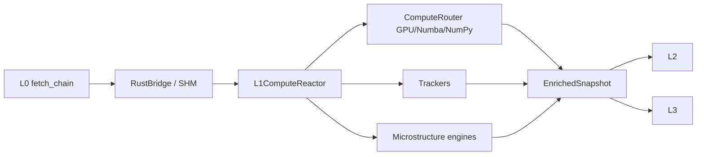

# L1 SOP — LOCAL COMPUTATION

> Version: 2026-03-12
> Layer: L1 Local Computation

## 1. Responsibility

L1 将 L0 快照转化为 `EnrichedSnapshot`，负责 Greeks、本地风险指标和微结构信号计算。

## 2. Architecture



## 3. Core Contract

`EnrichedSnapshot` 关键字段:

- `spot`
- `aggregates`
- `microstructure`
- `version`
- `computed_at`
- `extra_metadata`

语义要求:

- `version` 必须透传 L0 真实版本
- `extra_metadata.source_data_timestamp_utc` 必须绑定 L0 `as_of_utc`
- `microstructure.wall_context` 为可选合同字段，必须包含：
  - `gamma_regime`（`LONG_GAMMA|SHORT_GAMMA|NEUTRAL`）
  - `hedge_flow_intensity`
  - `counterfactual_vol_impact_bps`（诊断）
  - `near_wall_hedge_notional_m` 单位必须是 `Million USD`，不得二次缩放
- `microstructure.wall_migration.wall_context` 应与 `microstructure.wall_context` 同源
- `AggregateGreeks` 中的 `net_gex/call_wall/put_wall/flip_level_cumulative/zero_gamma_level` 一律视为 `OI-based structural proxy`，不得在合同注释或展示文案中升级为 dealer inventory truth
- `AggregateGreeks.net_vanna_raw_sum` / `net_charm_raw_sum` 是全链 raw Greek sum，明确不是 position-weighted / inventory exposure；`net_vanna` / `net_charm` 仅作为一阶段兼容 alias 保留
- GEX 统一口径（主链路与 legacy 一致，当前为基于 `open_interest` 的代理语义而非 dealer inventory 真值）：
  - `gex_per_contract = gamma * open_interest * contract_multiplier * spot^2 * 0.01 / 1_000_000`
  - `total_call_gex` 与 `total_put_gex` 必须是非负幅度值（单位：`Million USD`）
  - `net_gex = total_call_gex - total_put_gex`（输出单位：`Million USD`）
  - `flip_level_cumulative` 必须基于按 strike 排序后的 cumulative net GEX 首次过零点（深度图语义）
  - `zero_gamma_level` 必须基于 spot 网格重算 `net_gex(S)` 后的过零插值（真实 zero-gamma 语义）
  - `flip_level` 作为兼容别名，等于 `flip_level_cumulative`
  - 数据源未提供逐笔 `customer/dealer`、`open_close`、`aggressor_side` 标签时，不得将上述字段表述为“真实做市商库存”或“dealer truth”
- `vol_risk_premium` 在下游统一使用 `% points` 口径：`ATM_IV(%) - baseline_HV(%)`；`0.15` 与 `15.0` 基线输入必须视为同义

## 4. Performance Contract

- 重计算路径必须可异步卸载（`asyncio.to_thread`）
- 避免 GIL 阻塞主循环
- 大规模链路优先 GPU / 向量化
- 同一 `snapshot_version` 在计算环不得重复提交 GPU 任务；重复 tick 必须跳过并输出审计字段（`tick_id/snapshot_version/compute_id/gpu_task_id`）
- 禁止在微结构分支对 `RecordBatch` 做无效 `to_pylist()` 拷贝（仅在确有行级字段消费时允许）

## 5. Boundary Rules

- L1 不得依赖 L3/L4。
- L1 输出通过 `EnrichedSnapshot` 契约，不让上游实现细节泄漏。

## 6. Reliability Rules

- NaN/Inf 输入必须被清洗或隔离
- 越界衰减值需约束（例如不低于 -100%）
- 盘后策略按交易时段停更
- Opening ATM 在启动阶段若 `spot` 不可用，已持久化 anchor 必须进入 deferred-restore，待首个有效 `spot` 再执行严格距离校验恢复，禁止直接新开锚覆盖盘中历史
- Wall Migration 历史必须支持后端冷存储恢复（按交易日 JSONL），服务重启后恢复最近窗口，保证盘中历史连续
- Wall Migration 持久化失败必须显式日志降级，不得阻断 L1->L4 广播链路
- 墙体风险语义分层：`RETREAT` 为几何态（墙位后撤），`COLLAPSE` 为条件化风险态（需结合 short-gamma 与 flow-intensity）
- MTFIVEngine 必须采用几何状态机（`state=-1|0|1` + `relative_displacement/pressure_gradient/distance_to_vacuum/kinetic_level`），禁止输出统计语义字段（如 `zscore/z/strength`）
- 多周期输入必须独立封帧（1m/5m/15m 各自始末向量），禁止将同一瞬时 `atm_iv` 同步喂入所有周期
- MTFIVEngine 几何帧状态必须支持后端冷存储恢复（按交易日 JSONL 快照）；重启后恢复最近状态，减少 1m/5m/15m 暖机失真
- MTFIVEngine 持久化失败必须显式日志降级，不得阻断 `compute()` 与 L1->L4 广播链路

## 7. Observability

建议日志:

- `[L1ComputeReactor]`
- `[PERF]`
- Trackers 状态流转日志

## 8. Verification

```powershell
powershell -ExecutionPolicy Bypass -File scripts/test/run_pytest.ps1 l1_compute/tests
powershell -ExecutionPolicy Bypass -File scripts/test/run_pytest.ps1 scripts/test/test_l0_l4_pipeline.py
```
