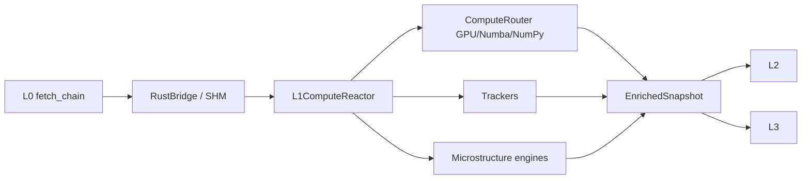

# L1 SOP — LOCAL COMPUTATION

> Version: 2026-03-07
> Layer: L1 Local Computation

## 1. Responsibility

L1 将 L0 快照转化为 `EnrichedSnapshot`，负责 Greeks、本地风险指标和微结构信号计算。

## 2. Architecture



## 3. Core Contract

`EnrichedSnapshot` 关键字段:

- `spot`
- `aggregates`
- `microstructure`
- `version`
- `computed_at`
- `extra_metadata`

语义要求:

- `version` 必须透传 L0 真实版本
- `extra_metadata.source_data_timestamp_utc` 必须绑定 L0 `as_of_utc`

## 4. Performance Contract

- 重计算路径必须可异步卸载（`asyncio.to_thread`）
- 避免 GIL 阻塞主循环
- 大规模链路优先 GPU / 向量化

## 5. Boundary Rules

- L1 不得依赖 L3/L4。
- L1 输出通过 `EnrichedSnapshot` 契约，不让上游实现细节泄漏。

## 6. Reliability Rules

- NaN/Inf 输入必须被清洗或隔离
- 越界衰减值需约束（例如不低于 -100%）
- 盘后策略按交易时段停更
- Opening ATM 在启动阶段若 `spot` 不可用，已持久化 anchor 必须进入 deferred-restore，待首个有效 `spot` 再执行严格距离校验恢复，禁止直接新开锚覆盖盘中历史
- Wall Migration 历史必须支持后端冷存储恢复（按交易日 JSONL），服务重启后恢复最近窗口，保证盘中历史连续
- Wall Migration 持久化失败必须显式日志降级，不得阻断 L1->L4 广播链路
- MTFIVEngine 窗口状态必须支持后端冷存储恢复（按交易日 JSONL 快照）；重启后恢复最近窗口，减少 1m/5m/15m 暖机失真
- MTFIVEngine 持久化失败必须显式日志降级，不得阻断 `compute()` 与 L1->L4 广播链路

## 7. Observability

建议日志:

- `[L1ComputeReactor]`
- `[PERF]`
- Trackers 状态流转日志

## 8. Verification

```powershell
powershell -ExecutionPolicy Bypass -File scripts/test/run_pytest.ps1 l1_compute/tests
powershell -ExecutionPolicy Bypass -File scripts/test/run_pytest.ps1 scripts/test/test_l0_l4_pipeline.py
```
