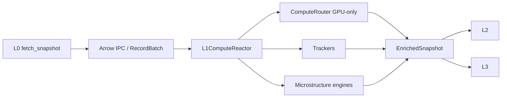

# L1 SOP — LOCAL COMPUTATION

> Version: 2026-03-17
> Layer: L1 Local Computation

## 1. Responsibility

L1 将 L0 快照转化为 `EnrichedSnapshot`，负责 Greeks、本地风险指标和微结构信号计算。

## 2. Architecture


```mermaid
flowchart LR
  A[L0 fetch_snapshot] --> B[Arrow IPC / RecordBatch]
  B --> C[L1ComputeReactor]
  C --> D[ComputeRouter GPU-only]
  C --> E[Trackers]
  C --> F[Microstructure engines]
  D --> G[EnrichedSnapshot]
  E --> G
  F --> G
  G --> H[L2]
  G --> I[L3]
```

## 3. Core Contract

`EnrichedSnapshot` 关键字段:

- `spot`
- `aggregates`
- `microstructure`
- `version`
- `computed_at`
- `extra_metadata`

语义要求:

- `version` 必须透传 L0 真实版本
- `extra_metadata.source_data_timestamp_utc` 必须绑定 L0 `as_of_utc`
- `extra_metadata.mm_flow_metrics` 必须透传 Rust owner 聚合指标（`net_delta_exposure_live/net_gamma_exposure_live/residual_delta_after_netting/oi_participation_ratio_live/flow_suppression_bias/flow_dominance_ratio/midpoint_tickrule_count/condition_filtered_count/complex_spread_count`），供 L2 直接进入 feature vector
- `extra_metadata.atm_iv_context` 作为运行时诊断合同字段时，必须保持稳定字典结构，至少包含 `atm_symbol/atm_strike/atm_distance/atm_iv/raw_iv/iv_source/iv_confidence/spot`
- L1 不得再依赖 L0 提供的 `aggregate_greeks` 或 `ttm_seconds` 兜底；这些值应由 L1 自身计算或由 shared 中立服务融合
- 当 L1 进入空快照/降级返回路径时，`extra_metadata` 必须保持透传，尤其是 `rust_active`、`shm_stats`、`source_data_timestamp_utc` 不得丢失
- `microstructure.wall_context` 为可选合同字段，必须包含：
  - `gamma_regime`（`LONG_GAMMA|SHORT_GAMMA|NEUTRAL`）
  - `hedge_flow_intensity`
  - `counterfactual_vol_impact_bps`（诊断）
  - `near_wall_hedge_notional_m` 单位必须是 `Million USD`，不得二次缩放
- `microstructure.wall_migration.wall_context` 应与 `microstructure.wall_context` 同源
- `AggregateGreeks` 中的 `net_gex/call_wall/put_wall/flip_level_cumulative/zero_gamma_level` 一律视为 `OI-based structural proxy`，不得在合同注释或展示文案中升级为 dealer inventory truth
- `AggregateGreeks.net_vanna_raw_sum` / `net_charm_raw_sum` 是全链 raw Greek sum，明确不是 position-weighted / inventory exposure；`net_vanna` / `net_charm` 仅作为一阶段兼容 alias 保留
- 公式语义 source-of-truth 必须指向 `shared/contracts/metric_semantics.py`；新增/变更文案不得绕开该 registry 自行定义 provenance
- `shared/contracts/metric_semantics.py` 现为 Rust-backed wrapper；registry source-of-truth 位于 `l0_ingest/l0_rust/src/contract_metrics.rs`。
- `shared/models/*.py` 已删除；L1/L2 对微结构与 flow 模型的 live import surface 统一为 `shared_rust.models`。
- `shared_rust.models` 为 Rust-only namespace extension；枚举状态、默认模型语义与 `model_validate/model_dump/model_copy` 行为由 Rust native owner 持有，consumer 不得再本地复制这些状态表或回退到 Python wrapper。
- `shared/services/l0_support/store/*` 已退出 Python owner 路径；L1 对 `MVCCChainStateStore` 的引用面统一为 `shared_rust.services_l0_support`，禁止恢复 `shared.services.l0_support.store.*` 导入。
- GEX 统一口径（主链路与 legacy 一致，当前为基于 `open_interest` 的代理语义而非 dealer inventory 真值）：
  - `gex_per_contract = gamma * open_interest * contract_multiplier * spot^2 * 0.01 / 1_000_000`
  - `total_call_gex` 与 `total_put_gex` 必须是非负幅度值（单位：`Million USD`）
  - `net_gex = total_call_gex - total_put_gex`（输出单位：`Million USD`）
  - `gex_regime` 正向分级阈值（`Million USD`）：`<800 => NEUTRAL`、`[800, 4000) => DAMPING`、`>=4000 => SUPER_PIN`
  - `net_gex < 0` 必须保持 `ACCELERATION`，不参与 `DAMPING/SUPER_PIN` 正向分级
  - `flip_level_cumulative` 必须基于按 strike 排序后的 cumulative net GEX 首次过零点（深度图语义）
  - `zero_gamma_level` 必须基于 spot 网格重算 `net_gex(S)` 后的过零插值（真实 zero-gamma 语义）
  - `flip_level` 作为兼容别名，等于 `flip_level_cumulative`
  - 数据源未提供逐笔 `customer/dealer`、`open_close`、`aggressor_side` 标签时，不得将上述字段表述为“真实做市商库存”或“dealer truth”
- `vol_risk_premium` 在下游统一使用 `% points` 口径：`ATM_IV(%) - baseline_HV(%)`；`0.15` 与 `15.0` 基线输入必须视为同义

## 4. Performance Contract

- 重计算路径必须可异步卸载（`asyncio.to_thread`）
- 避免 GIL 阻塞主循环
- 重计算路径必须 GPU-only；禁止 CPU（Numba/NumPy）参与重计算
- 同一 `snapshot_version` 在计算环不得重复提交 GPU 任务；重复 tick 必须跳过并输出审计字段（`tick_id/snapshot_version/compute_id/gpu_task_id`）
- 同一 `snapshot_version` 的 dedup tick 虽然不得重跑 L1/L2，但若 `AtmDecayTracker.update()` 能产出新 ATM sample，compute loop 仍必须沿既有 L3 payload 合同续推该 `atm` live tick，禁止因 dedup 把三条 ATM 曲线整段冻结
- 禁止在微结构分支对 `RecordBatch` 做无效 `to_pylist()` 拷贝（仅在确有行级字段消费时允许）
- BSM Tier-3 现为 Rust-only owner：`shared_rust.services.bsm_batch_numpy_tier`；Rust owner 不可用或执行失败必须显式抛错，禁止回退 Python NumPy
- `StreamingAggregator.full_recompute()` 聚合与 wall 选择现为 Rust-only owner：`shared_rust.services.aggregate_greeks_full/select_walls`；Rust owner 不可用或执行失败必须显式抛错，禁止回退 Python fallback
- BSM 聚合与 zero-gamma 结构重算现为 Rust-only owner：`shared_rust.services.aggregate_from_greeks/estimate_zero_gamma_level`；`bsm_fast` 与 `streaming_aggregator` 主路径必须 fail-fast，禁止恢复 Python fallback
- `StreamingAggregator` bridge 现必须直接传递现成 `GreeksMatrix` 数组与原生 strike 序列到 Rust owner；`_find_flip_level()` 已迁出，`flip_level_cumulative` 由 Rust `aggregate_greeks_full` 回传，禁止重新引入 Python 侧 NumPy marshalling
- `GreeksEngine` 的 live batch orchestration 现必须通过 `shared.services.greeks_engine_batch.build_greeks_batch_sync` 进入 Rust owner；`l1_compute/analysis/greeks_engine.py` 不得再调用 `l1_compute.analysis.bsm_fast.compute_greeks_batch()`，也不得在本文件内保留 NumPy marshalling
- `wall_context_builder` 的数值计算 owner 现为 Rust `shared_rust.services.compute_wall_context_metrics/estimate_near_wall_liquidity/classify_wall_gamma_regime`；`RecordBatch` 分支必须直入 Rust，禁止在 Python 侧 `to_pylist()`/NumPy 算术回退；当前 Rust owner 仍允许内部数组物化路径，若进入热点需继续收敛到更低拷贝实现
- `wall_context_builder` Python delegation 层必须对 Rust 返回值做合同硬校验：`gamma_regime` 仅允许 `SHORT_GAMMA|LONG_GAMMA|NEUTRAL`；`near_wall_liquidity` 必须 finite 且 `>= 1.0`；其余 wall-context 数值字段必须 finite；任一违规必须显式抛错，禁止静默纠偏

## 5. Boundary Rules

- L1 不得依赖 L3/L4。
- L1 输出通过 `EnrichedSnapshot` 契约，不让上游实现细节泄漏。

## 6. Reliability Rules

- NaN/Inf 输入必须被清洗或隔离
- 越界衰减值需约束（例如不低于 -100%）
- 盘后策略按交易时段停更
- 盘后如启用 `ATM_DECAY_REPLAY_ENABLED`，仅允许走 test-only replay：L1 tracker 必须把历史 ATM 序列映射到当天标准 history/anchor，并通过既有 `update()` / `compute_current_decay()` 返回 replay tick；默认 live 盘后停更语义不得改变
- Opening ATM 在启动阶段若 `spot` 不可用，已持久化 anchor 必须进入 deferred-restore，待首个有效 `spot` 再执行严格距离校验恢复，禁止直接新开锚覆盖盘中历史
- Wall Migration 历史必须支持后端冷存储恢复（按交易日 JSONL），服务重启后恢复最近窗口，保证盘中历史连续
- Wall Migration 持久化失败必须显式日志降级，不得阻断 L1->L4 广播链路
- 墙体风险语义分层：`RETREAT` 为几何态（墙位后撤），`COLLAPSE` 为条件化风险态（需结合 short-gamma 与 flow-intensity）
- MTFIVEngine 必须采用几何状态机（`state=-1|0|1` + `relative_displacement/pressure_gradient/distance_to_vacuum/kinetic_level`），禁止输出统计语义字段（如 `zscore/z/strength`）
- 多周期输入必须独立封帧（1m/5m/15m 各自始末向量），禁止将同一瞬时 `atm_iv` 同步喂入所有周期
- MTFIVEngine 几何帧状态必须支持后端冷存储恢复（按交易日 JSONL 快照）；重启后恢复最近状态，减少 1m/5m/15m 暖机失真
- MTFIVEngine 持久化失败必须显式日志降级，不得阻断 `compute()` 与 L1->L4 广播链路
- GPU 不可用或 GPU 运行失败时，必须显式降级为 `compute_tier=gpu_only_blocked`，并禁止触发 CPU 重计算
- ATM Decay 在无法计算时必须记录锁定 call/put 两腿的字段级诊断快照，至少包含 `bid/ask/last_price` 与 `mid_price`，并通过 tracker/storage 的独立诊断流持久化，便于回溯价格饥饿问题
- 诊断快照必须与正常 decay series 分离，避免污染 `atm_decay` 主历史序列；日志与持久化字段应保持与 anchor/helper 的纯逻辑边界一致
- Opening anchor 刚锁定后的首个 decay tick 若仍是完全平值（`call/put/straddle = 0`），不得立刻写入主历史序列；应等待锁定后首次真实价格偏移，给 L0 mandatory-symbol price repair 留出恢复窗口
- Restore/deferred-restore 读取已持久化 anchor 时，若当日最新 ATM history 点与该 anchor 的 `locked_at` 对齐且 `call/put/straddle` 全为 `0`，必须视为坏锚并直接丢弃，禁止把这类 flat-zero opening point 恢复成当前活动 anchor
- 若系统在盘中启动且当天不存在可恢复的有效 anchor，启动阶段必须基于首个 `fetch_chain()` 快照立即尝试一次 intraday bootstrap lock；禁止把当天锁锚延迟到“下个交易日”或仅依赖后续慢热门槛
- 若启动阶段存在 deferred restore anchor，intraday bootstrap 必须先对该 pending anchor 做严格 restore/discard 判定；若 pending anchor 因距离校验等原因被丢弃，startup retry 窗口必须继续 fresh capture，同次启动内完成 same-day 重锁，禁止因为 pending 标记残留而整段跳过 bootstrap
- 若 fresh capture 连续失败，tracker 必须按固定阈值输出 INFO 级 stall forensic log，至少包含 `failures/context/spot/chain/zero_dte/integer_strikes`，便于区分 quote connectivity 缺链与选锚逻辑失败
- 若当前活动 anchor 连续多 tick 因同一对锚定腿缺失/非正价而触发 `raw_pct_unavailable`，tracker 必须显式失效该 anchor 并清除当日持久化 anchor，允许系统在后续 live tick 上重新锁定新的 ATM；禁止无限期粘住失效锚点
- housekeeping 对 anchor mandatory symbols 必须做全量同步；当 anchor 清空时必须显式下发空集合，禁止旧 mandatory 腿继续黏在 price repair / subscription 路径里
- After-hours replay source 选择必须排除平台化窗口；首尾 `0/0/0` flat row 不得作为回放窗口边界写入 today history
- ATM decay history 在 append/recover/read 路径必须先做 timestamp 卫生：仅允许当前 trade date、按 timestamp 升序、按标准化 timestamp 去重；若当日 history 混入未来时间点，必须在恢复/API 暴露前剔除，禁止把污染样本直接送到 `/api/atm-decay/history`

## 7. Observability

建议日志:

- `[L1ComputeReactor]`
- `[PERF]`
- Trackers 状态流转日志

## 8. Verification

```bash
python manage.py run-pytest l1_compute/tests
python manage.py run-pytest scripts/test/test_l0_l4_pipeline.py
```
