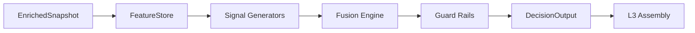

# L2 SOP — DECISION ANALYSIS

> Version: 2026-03-12
> Layer: L2 Decision & Risk

## 1. Responsibility

L2 消费 `EnrichedSnapshot`，运行特征抽取、信号融合和护栏裁决，产出 `DecisionOutput`。

## 2. Architecture



## 3. Decision Contract

`DecisionOutput` 必须包含:

- 融合后的主信号
- 护栏裁决结果
- `feature_vector`（含前端关键观测字段）
- 下游兼容字段 `data.fused_signal`（供 L3 typed assembler 直连消费）

### 3.1 Legacy Shim Removal (P2 Stage2)

- `DecisionOutput.to_legacy_agent_result` 已移除。
- `compute_loop` 与 L3 仅通过 typed contract（`DecisionOutput` + `DecisionOutput.data`）直通，不再构造 legacy 中间结果。

## 4. Guard Priority

建议按优先级短路:

1. KillSwitch
2. JumpGate
3. Frequency/Session constraints
4. VRP veto

### 4.1 VRP Veto Stability Rule (P0.5)

- VRP veto 必须采用滞回控制，禁止单阈值抖动触发。
- 默认参数:
  - `entry_threshold = 0.15`
  - `exit_threshold = 0.13`
  - `min_hold_ticks = 3`
- 上述阈值以及 Drawdown/Session Guard 参数必须由配置驱动（`guard_*`），禁止在 Guard 实现层硬编码策略阈值。
- 激活逻辑:
  - 未激活时仅当 `vrp > entry_threshold` 进入 veto。
  - 激活后在 `vrp >= exit_threshold` 区间保持 veto。
  - 仅当满足最小持有 tick 且连续低于退出阈值确认后才退出。
- Session reset 必须清空 veto 内部状态，避免跨日状态泄漏。

## 5. Boundary Rules (Hard)

- 禁止 `l2_decision -> l3_assembly`
- 禁止 `l2_decision -> l4_ui`
- `l2_decision/agents/services` 禁止导入 `l1_compute.analysis/*`

## 6. Data Semantics

- L2 不重写 L0/L1 时间语义
- 不在 L2 引入展示层样式/配色语义
- L2 必须将 `net_gex/call_wall/put_wall/zero_gamma_level` 视为 L1 输出的 `OI-based proxy` 结构语义；在缺少逐笔库存标签的数据源上，不得升级表述为 dealer inventory 真值
- `net_gex_normalized` 必须以 L1 `net_gex`（单位 `Million USD`）为输入，并按 `$1B` 口径归一：`net_gex / 1000`
- `gamma_flip` 必须优先基于 `spot` 与 L1 `zero_gamma_level` 判定（`spot < zero_gamma_level` 视为负 gamma），仅在缺失 `zero_gamma_level` 时回退 `net_gex < 0`
- `call_wall_distance` 仅描述 spot 到 `call_wall` 代理位的几何距离，不得被解释为真实 dealer ceiling
- `vol_risk_premium` 必须输出 `% points`，并复用统一标准化逻辑处理 `0.15`/`15.0` 两类 baseline HV 输入
- `skew_25d_normalized` 与 `rr25_call_minus_put` 必须共享同一组真 25Δ 选腿：
  - CALL 使用 `+0.25`，PUT 使用 `-0.25`
  - 仅当两侧 delta 距离均在容差 `±0.10` 内时才判定有效
  - IV 读取优先级：`computed_iv` > `iv` > `implied_volatility`
  - delta 读取优先级：`computed_delta` > `delta`
- `skew_25d_normalized` 明确定义为 legacy 工程字段 `(put_iv - call_iv) / atm_iv`
- `rr25_call_minus_put` 明确定义为 canonical 25Δ risk reversal `call_iv - put_iv`
- L2 必须同时输出 `skew_25d_valid`（1/0）以区分“真实 0”与“不可计算”
- L2 对 `net_vanna_raw_sum` / `net_charm_raw_sum` 必须优先消费 canonical raw-sum 字段；`net_vanna` / `net_charm` 仅作兼容 alias，不得在文案中表述为 inventory exposure
- `vrp_realized_based` 仅允许进入 research / diagnostics / optional feature path；现网默认决策继续使用 proxy `vol_risk_premium`
- `realized_volatility_15m` 必须由本地 rolling spot log-return 计算得到，按 decimal annualized vol 输出；`vrp_realized_based` 必须先将该 RV 显式换算到 `%` 后再进入 `compute_vrp()`

## 7. Observability

建议日志:

- `GuardRailEngine` 触发链
- 融合前后信号差异
- 风险拒绝原因

## 8. Verification

```powershell
powershell -ExecutionPolicy Bypass -File scripts/test/run_pytest.ps1 l2_decision/tests
powershell -ExecutionPolicy Bypass -File scripts/test/run_pytest.ps1 scripts/test/test_l0_l4_pipeline.py
```

## 9. Offline Threshold Calibration (Decoupled Tooling)

- MOMENTUM 阈值离线校准必须在独立工具链中执行，不得耦合进 L2 运行时主链。
- 当前工具入口位于 `tools/momentum_calibration/`，仅输出候选配置与评估报告。
- K-line 先行阶段仅优化 `roc_bull_threshold` / `roc_bear_threshold`：
  - `bbo_confirmation_min` 固定为线上配置，不参与本轮优化。
  - `max_roc_reference` 与 `confidence_floor` 保持冻结。
- 工具运行不得突破 Longbridge 官方速率上限，并应预留对 Research 特征接口的兼容扩展位。

### 9.1 MOMENTUM Live Baseline (Current)

- 生效日期（ET）: 2026-03-10
- `roc_bull_threshold = 0.0005`
- `roc_bear_threshold = -0.0005`
- `bbo_confirmation_min = 0.1`（冻结）
