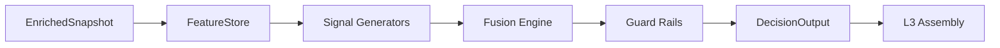

# L2 SOP — DECISION ANALYSIS

> Version: 2026-03-09
> Layer: L2 Decision & Risk

## 1. Responsibility

L2 消费 `EnrichedSnapshot`，运行特征抽取、信号融合和护栏裁决，产出 `DecisionOutput`。

## 2. Architecture



## 3. Decision Contract

`DecisionOutput` 必须包含:

- 融合后的主信号
- 护栏裁决结果
- `feature_vector`（含前端关键观测字段）

## 4. Guard Priority

建议按优先级短路:

1. KillSwitch
2. JumpGate
3. Frequency/Session constraints
4. VRP veto

## 5. Boundary Rules (Hard)

- 禁止 `l2_decision -> l3_assembly`
- 禁止 `l2_decision -> l4_ui`
- `l2_decision/agents/services` 禁止导入 `l1_compute.analysis/*`

## 6. Data Semantics

- L2 不重写 L0/L1 时间语义
- 不在 L2 引入展示层样式/配色语义
- `skew_25d_normalized` 必须基于真 25Δ 口径：
  - CALL 使用 `+0.25`，PUT 使用 `-0.25`
  - 仅当两侧 delta 距离均在容差 `±0.10` 内时才判定有效
  - IV 读取优先级：`computed_iv` > `iv` > `implied_volatility`
  - delta 读取优先级：`computed_delta` > `delta`
- L2 必须同时输出 `skew_25d_valid`（1/0）以区分“真实 0”与“不可计算”

## 7. Observability

建议日志:

- `GuardRailEngine` 触发链
- 融合前后信号差异
- 风险拒绝原因

## 8. Verification

```powershell
powershell -ExecutionPolicy Bypass -File scripts/test/run_pytest.ps1 l2_decision/tests
powershell -ExecutionPolicy Bypass -File scripts/test/run_pytest.ps1 scripts/test/test_l0_l4_pipeline.py
```
