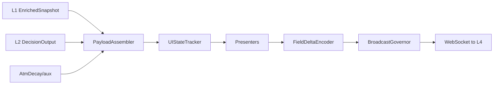

# L3 SOP — OUTPUT ASSEMBLY

> Version: 2026-03-07
> Layer: L3 Payload Assembly & Broadcast

## 1. Responsibility

L3 将 L1/L2 数据组装为前端可消费 payload，管理全量/增量广播和 UI 状态契约。

## 2. Architecture



## 3. Payload Contract

顶层关键字段:

- `timestamp/data_timestamp`（L0 源数据时钟）
- `broadcast_timestamp/heartbeat_timestamp`（L3 广播时钟）
- `ui_state`
- `rust_active`
- `shm_stats`

### 3.1 UI State Contract (Right Panel)

必须稳定输出:

- `ui_state.tactical_triad`
- `ui_state.skew_dynamics`
- `ui_state.mtf_flow`
- `ui_state.active_options`

规则:

- `active_options.option_type` 统一 `CALL|PUT`
- 保留 `impact_index` 与 `is_sweep`
- 不返回空结构破坏前端渲染
- `/history` 默认视图必须为 `compact`，禁止默认返回重字段全量 payload
- 研究下载必须走字段投影（`fields`）与时间降采样（`interval`），超限查询进入异步导出

### 3.2 Research Feature Store

- L3 必须维护 `research_feature_store` 三层数据：
  - `raw-lite`（短期）
  - `feature`（中期）
  - `label/outcome`（长期）
- 存储格式必须优先 Parquet + ZSTD，支持 `jsonl` 调试导出
- 研究表主键必须包含 `data_timestamp + l0_version`，用于跨层 join 对齐

## 4. Boundary Rules (Hard)

- 禁止 `l3_assembly -> l4_ui`
- 仅允许 `l3_assembly -> l2_decision.events/*`
- 禁止 `l3_assembly/presenters/ui -> l1_compute.analysis|trackers`
- 禁止 `l3_assembly/assembly -> l1_compute.analysis|trackers`

## 5. Delta Strategy

- 高频循环优先发送 patch/delta
- 周期性全量刷新用于纠偏
- 精度收敛与窗口裁剪防止带宽放大

## 6. Observability

关键日志:

- `[L3 Assembler]`
- payload size / delta ratio
- broadcast backlog and client lag

## 7. Verification

```powershell
powershell -ExecutionPolicy Bypass -File scripts/test/run_pytest.ps1 l3_assembly/tests
powershell -ExecutionPolicy Bypass -File scripts/test/run_pytest.ps1 scripts/test/test_l0_l4_pipeline.py
```
