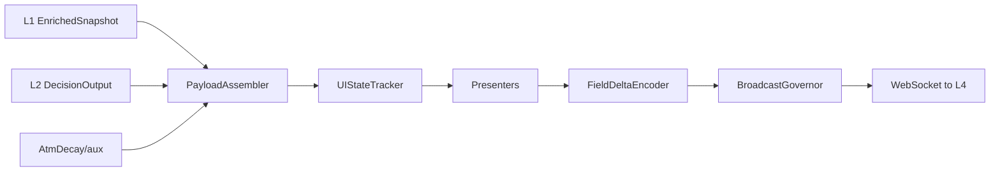

# L3 SOP — OUTPUT ASSEMBLY

> Version: 2026-03-11
> Layer: L3 Payload Assembly & Broadcast

## 1. Responsibility

L3 将 L1/L2 数据组装为前端可消费 payload，管理全量/增量广播和 UI 状态契约。

## 2. Architecture


```mermaid
flowchart LR
  A[L1 EnrichedSnapshot] --> D[PayloadAssembler]
  B[L2 DecisionOutput] --> D
  C[AtmDecay/aux] --> D
  D --> E[UIStateTracker]
  E --> F[Presenters]
  F --> G[FieldDeltaEncoder]
  G --> H[BroadcastGovernor]
  H --> I[WebSocket to L4]
```

## 3. Payload Contract

顶层关键字段:

- `timestamp/data_timestamp`（L0 源数据时钟）
- `broadcast_timestamp/heartbeat_timestamp`（L3 广播时钟）
- `ui_state`
- `agent_g.data.micro_structure`（诊断通道；可承载 canonical raw Greek live debug 字段，如 `micro_structure_state.net_vanna_raw_sum`）
- `agent_g.data.header_volatility`（标题栏动态波动上下文；固定包含 `lookback_days/lookback_effective_days/ivr/ivp/term_structure/iv_price_relation`）
- `agent_g.data.mm_flow`（机构流向合同字段；来源于 L2 `fused_signal.mm_flow`，并要求在 delta 路径可增量更新）
- `rust_active`
- `shm_stats`
- `shared/system/snapshot_builder.py` 已退役；`L3AssemblyReactor` 直接由 `PayloadAssemblerV2` 组装 payload，不再保留 legacy SnapshotBuilder shadow compare。

### 3.1 UI State Contract (Right Panel)

必须稳定输出:

- `ui_state.tactical_triad`
- `ui_state.skew_dynamics`
- `ui_state.mtf_flow`
- `ui_state.active_options`
- `ui_state.skew_dynamics` live source-of-truth 必须使用 `rr25_call_minus_put` + `skew_25d_valid` gate；`skew_25d_normalized` 仅保留 compatibility/research 路径，不得驱动 live UI
- `ui_state.tactical_triad.charm` live source-of-truth 必须使用 `net_charm_raw_sum`；legacy `net_charm` 仅保留 compatibility/research 路径

规则:

- `active_options.option_type` 统一 `CALL|PUT`
- `active_options.flow` 必须是展示用 signed USD 流金额（与 FLOW 文本和颜色同源）
- `active_options.flow_score` 必须承载 DEG 方向分数（`flow_deg`），仅用于分析/调试，不驱动 FLOW 配色
- `active_options.flow_direction/flow_color` 必须由 `flow` 金额符号派生（正=红/BULLISH，负=绿/BEARISH，零=NEUTRAL）
- `active_options` 非占位行必须显式输出 `flow_direction/flow_intensity/flow_color/flow_glow` 四元组；禁止依赖 L4 派生
- `active_options.flow_signal_state` 必须输出 `LIVE|DEGRADED`；当信号降级时必须同时输出 `flow_signal_reason`（如 `missing_gamma/missing_vanna/missing_turnover/all_engines_inactive`）
- `active_options` 后端仅输出真实行；固定 5 行展示由 L4 model 层补占位，不得在 L3/L0 伪造 fallback 行
- `active_options` 必须按每个 source tick 直接提交最新 Top5 结果，禁止使用多 tick signature 确认门限（如 switch-confirm）延后提交，防止 UI 排行冻结
- `active_options.is_placeholder`（bool）与 `active_options.slot_index`（1..5）为固定槽位契约字段，必须稳定透传
- `ui_state.micro_stats.net_gex` 的上游 `gex_regime` 合同只允许 `SUPER_PIN|DAMPING|ACCELERATION|NEUTRAL`；未知值必须在 L3 fail-fast 抛错，禁止静默降级到 `NEUTRAL`
- `shared/services/active_options_runtime.py`、`shared/services/active_options_input.py`、`shared/services/active_options_engines.py` 现为 root-neutral Python surface；实际 owner 位于 `shared_rust.services`，禁止恢复 `_active_options_*` Python helper owner
- `mtf_flow` 必须是纯状态合同：`m1/m5/m15.{state,relative_displacement,pressure_gradient,distance_to_vacuum,kinetic_level}`
- `mtf_flow` 严禁携带视觉字段（如 `dot_color/text_color/border/animate/align_color`）与统计语义字段（如 `zscore/z/strength`）
- 保留 `impact_index` 与 `is_sweep`
- 不返回空结构破坏前端渲染
- `ui_state.depth_profile` 的可见 strike 窗口必须固定奇数行并严格围绕 `spot` 上下对称；当 `gamma_flip_level` 落在窗口外侧时必须保持固定行数且不打 `is_flip`，禁止扩窗、禁止平移中心
- flip 单一事实源：`agent_g.data.gamma_flip_level` 与 `ui_state.depth_profile[*].is_flip` 必须同源于 `zero_gamma_level`；当 `zero_gamma_level` 无效时必须输出 `gamma_flip_level=null` 且不打 `is_flip`，禁止回退 `flip_level_cumulative`
- `/history` 默认视图必须为 `compact`，禁止默认返回重字段全量 payload
- 研究下载必须走字段投影（`fields`）与时间降采样（`interval`），超限查询进入异步导出
- 历史查询接口支持版本协商：`schema=v1|v2`（默认 `v2`，`v1` 仅兼容保留）
- `schema=v2` 统一返回列式 JSON 包络：`{schema:"v2", encoding:"columnar-json", columns, rows, count, ...meta}`
- `format=parquet` 路径优先级高于 schema（保持现有二进制下载语义不变）
- history v2 的列式 payload helper 已切到 `shared_rust.services`；`shared/services/history_columnar.py` 不再保留 compat owner
- `wall_migration_data.wall_context` 为可选透传字段；缺失时必须安全回退，不得抛错
- `micro_stats.wall_dyn` 语义规则：
  - 主语义 `RETREAT` 表示墙体后撤（含 `RETREATING_RESISTANCE` 与 `RETREATING_SUPPORT`）
  - 展示层必须区分方向：`RETREAT ↑`（call wall 上移，红）与 `RETREAT ↓`（put wall 下移，绿）
  - `COLLAPSE` 仅在 put 后撤且 `wall_context.gamma_regime=SHORT_GAMMA` 且 `hedge_flow_intensity` 超阈值时触发
  - Debounce 仅允许作用于 `PINCH/SIEGE` 噪声态；`BREACH/RETREAT ↑/RETREAT ↓/COLLAPSE` 必须同 tick 生效

### 3.2 Research Feature Store

- L3 运行时只允许维护单一 durable owner：`research/canonical/day_YYYYMMDD.parquet`
- `canonical` schema 必须同时承载当前 `feature` 字段与远期 `label/outcome` 字段；未成熟 label 初始为 `null`
- 存储格式必须优先 Parquet + ZSTD，支持 `jsonl` 调试导出
- `ResearchFeatureStore` 与 `HeaderVolatilityContextService` 的 live owner 已切到 `shared_rust.services`
- `shared_rust.services` 内部访问 `l0_rust` 必须经 `shared.services.l0_runtime.native_loader.l0_rust`；禁止回退到 `_native_generated.l0_rust` 旧路径。
- `shared/services/research_feature_store.py`、`shared/services/research_feature_store_io.py`、`shared/services/header_volatility_context.py` 已退役，不得再恢复 Python compat owner
- `/api/research/features`、`/api/research/exports/*` 现直接调用 `shared_rust.services.ResearchFeatureStore` 的同步接口；路由层不再保留这组 root owner 的 async Python 壳
- 研究表主键必须包含 `data_timestamp + l0_version`，用于跨层 join 对齐
- `ResearchFeatureStore` 的 parquet 持久化必须采用单文件重写提交：读取当日 canonical -> 纯内存合成下一版 -> `temp file -> fsync -> atomic replace`
- Windows 提交必须使用文件级原子替换原语，禁止恢复目录 `fsync` 依赖或多文件分步提交
- `ResearchFeatureStore` 初始化必须直接绑定配置的 `research_store_root`；root 不可写或不是目录时必须立即失败，禁止回退到临时目录。
- 运行时不得再写 `research/raw`、`research/feature`、`research/label` 目录；这三类文件只允许由 EOD archive 从 canonical 投影生成
- `ResearchFeatureStore` 的 label pending queue 只能在 canonical 成功提交后注册；禁止出现未落 canonical 的 label-only 样本。
- `ResearchFeatureStore` 的 label continuity owner 不得依赖纯内存 `pending_labels`。backend 启动时必须基于最新 `day_<date>.parquet` 重放恢复未成熟队列，并补齐缺失但已成熟的 label；禁止因重启把 60 分钟标签窗口直接清零。
- `append_tick()` 对 `payload.data_timestamp`、`snapshot.spot`、`payload.fused_signal.mm_flow` 等持久化关键字段必须严格校验；禁止回退到进程时间或静默跳过非法样本
- `research_store.append_tick()` 失败是 fatal runtime 事件：L3 不得吞错，不得继续 broadcast 旧 payload，不得以 neutral payload 掩盖 research persistence 破坏。
- 当 L1 因 `n_valid=0` 或等价 bypass 条件返回 empty snapshot 时，只要同 tick 的 L0 source `spot` 有效，`app/loops/compute_loop.py` 必须在进入 L3 前保留该 source spot；禁止把首帧 live tick 降级为 `spot=0.0` 并触发 research persistence fatal。
- EOD 归档质量闸门触发时必须阻断主日型分类并标记 `primary_day_type=INCOMPLETE_SOURCE`，禁止在低质量样本上输出 `balance_day` 等交易日型结论。
- EOD archive 必须以 canonical 作为 runtime research 输入，在 staging 树下生成 `research_raw` / `research_feature` / `research_label` 冻结产物后再统一 publish；已存在最终产物时必须 fast-fail，禁止覆盖或边写边发布。
- `ResearchFeatureStore` 采样必须限制为 RTH (`09:30-16:00 ET`) 且固定 1s 频率（同一秒最多一行）；禁止事件触发扩采样导致样本间隔不稳定。
- 研究存储契约采用最小字段集：`feature/compact` 仅保留编码字段 `direction_code/iv_regime_code/gex_intensity_code`，禁止在落盘层重复写入同义字符串状态。
- `feature` tier 必须持久化 MM FLOW 9 字段：`net_delta_exposure_live/net_gamma_exposure_live/residual_delta_after_netting/oi_participation_ratio_live/flow_suppression_bias/flow_dominance_ratio/midpoint_tickrule_count/condition_filtered_count/complex_spread_count`；`append_tick` 遇到缺失或非数值必须显式报错，禁止 fallback。
- Parquet 研究存储写入必须使用 `zstd` 高压缩配置（level=19, no statistics）以最小化磁盘占用。

## 4. Boundary Rules (Hard)

- 禁止 `l3_assembly -> l4_ui`
- 仅允许 `l3_assembly -> l2_decision.events/*`
- 禁止 `l3_assembly/presenters/ui -> l1_compute.analysis|trackers`
- 禁止 `l3_assembly/assembly -> l1_compute.analysis|trackers`

## 5. Delta Strategy

- 高频循环优先发送 patch/delta
- 周期性全量刷新用于纠偏
- 精度收敛与窗口裁剪防止带宽放大
- `app/loops/broadcast_loop.py` 不得再以与 compute loop 无关的独立轮询节拍等待最新 payload；新 payload 必须在发布后立即触发 broadcast，空窗期才允许按 `ws_broadcast_interval` 执行 heartbeat 重发
- `app/loops/compute_loop.py` 与 `app/loops/broadcast_loop.py` 的调度关系必须避免“双 1Hz 未锁相定时器”带来的额外整周期等待；若 wire 可见延迟退化到接近一个 broadcast 周期，视为广播调度缺陷而非可接受行为
- 当 payload 业务字段未变化时，`dashboard_delta` 允许仅携带 `heartbeat_timestamp`；这表示链路存活，不表示指标重算
- 当业务字段发生变化时，`dashboard_delta.changes` 必须透传顶层契约字段变更（包括 `version/data_timestamp/broadcast_timestamp/drift_ms/drift_warning/is_stale/rust_active/shm_stats`）
- `SPY` 顶层 `spot` 不得再被 `app/loops/compute_loop.py` 的 1Hz cadence 绑死；live `SPY.US` spot 必须通过独立 fast lane 直接覆盖当前 wire payload，并立即触发 `dashboard_delta`
- `spot` fast lane 与 full compute lane 必须共享单一单调 `payload.version` 语义，但 compute-owned 分析子树（如 ActiveOptions / ATM / Tactical panels）仍保留原 compute source version，不得因 live spot overlay 被伪装成已重算
- `governor_telemetry.quote_lane` 是 quote-lane 观测字段的唯一聚合面；L3 必须把 L0 raw depth cadence（如 `last_source_gap_ms/source_event_count_1s`）、distinct midpoint cadence（如 `last_distinct_spot_gap_ms/distinct_spot_count_1s`）与当前 wire 发送信息（如 `wire_emit_timestamp_utc/wire_emit_lag_ms`）一起挂到该节点，禁止再散落到自定义顶层字段。
- raw source arrival 即使没有带来新的 distinct midpoint，也必须通过 telemetry-only overlay bump payload epoch，把新的 `governor_telemetry.quote_lane` 推到 wire；该路径不得改写顶层 `spot/version`。

## 6. Observability

关键日志:

- `[L3 Assembler]`
- `[L3-PAYLOAD]` payload 可视化摘要：必须显式输出 `depth_profile` 行数/关键 strikes 与 `atm` 状态
- `[L3-PAYLOAD]` 当 `agent_g.data.header_volatility` 存在时，必须额外输出 `lookback/effective_days/ivr/ivp/term_structure/iv_price_relation` 摘要，便于盘中核对标题栏上下文是否连续刷新
- `atm_status` 语义必须区分：
  - `LIVE`
  - `MISSING_OUTSIDE_RTH`
  - `MISSING`
- payload size / delta ratio
- broadcast backlog and client lag
- `/debug/persistence_status` 必须可同时观察 `header_volatility.payload` 与 `l1_runtime.header_volatility_aux`，用于确认 L0 辅助取数、L3 payload 合同和 L4 标题栏消费链路连续一致
- `shared/system/tactical_triad_logic.py` 现为 Rust-backed wrapper；`UIStateTracker` 使用的 VRP/S-VOL 归一化语义必须继续通过该中立边界消费，禁止在 L3 本地复制规则。
- `shared/services/header_volatility_context.py` 与 `shared/services/history_columnar.py` 现为 Rust-backed wrapper；L3 标题栏波动率上下文和 `/history` v2 columnar 封装必须继续通过这些中立边界消费，禁止在 L3 或路由层本地复制 IVR/IVP、term-state、columnar schema 常量。
- `shared/services/research_feature_store_schema.py` 的 `valid_views/intervals/formats` 与 compact/feature/label field contracts 现由 Rust native spec 持有；research store 与 UI hydration 只能消费该单一 owner，不得重新定义字段 allowlist。
- 该 schema/util owner 现已切到 `shared_rust.services`；`shared/services/research_feature_store_schema.py` 与 `shared/services/research_feature_store_utils.py` 已删除
- `shared/services/research_feature_store_io.py` 的 compact projection、field projection、interval downsample 现由 Rust native helper 持有；`ResearchFeatureStore.query()`、`latest_feature_view()` 与 `/history` 路由不得在 Python 侧重建同一套查询整形语义。
- `shared/services/research_feature_store_io.py` 的 JSONL export bytes 生成与 retention 删除候选判定现由 Rust native helper 持有；Python 侧仅保留 parquet 编码、文件 I/O 与 job orchestration，不得在路由或调用层重新复制导出/清理规则。
- `shared/services/research_feature_store.py` 的发样判定、LongPort 诊断列归一化、label row 序列化现由 Rust native helper 持有；Python 侧仅保留 pyarrow 存储写入与高层 orchestration，不得重新复制这些状态转移与字段归一化语义。
- `shared/services/research_feature_store_io.py` 的 range-file 与 latest-file 选择现由 Rust native helper 持有；Python 侧只负责实际 parquet 读取与过滤，不得在 I/O 层重新复制日期/文件选择规则。
- `shared/services/research_feature_store_io.py` 与 `shared/services/research_feature_store.py` 的 parquet bytes 编码、parquet 读取、parquet append/write、export readback 现由 Rust native helper 持有；Python 侧保留 job scheduling 和错误日志，但不再持有底层 storage execution 语义。

## 7. Verification

```bash
python manage.py run-pytest l3_assembly/tests
python manage.py run-pytest scripts/test/test_l0_l4_pipeline.py
```

