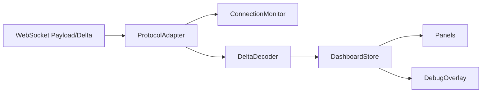

# L4 SOP — FRONTEND

> Version: 2026-03-07
> Layer: L4 UI Runtime

## 1. Responsibility

L4 负责消费 L3 协议数据并稳定渲染决策面板、风险状态与诊断信息。

## 2. Architecture



## 3. Runtime Rules

- 协议层和渲染层解耦
- Store 是前端状态单一事实源
- 组件通过 selector 精准订阅

## 4. Contract Consumption Rules

- `payload.timestamp/data_timestamp` 按 L0 数据时间解释
- `heartbeat_timestamp` 按链路心跳解释
- 右栏模型必须先 normalize 再渲染

### 4.1 Right Panel Typed Contract

禁止弱类型直读关键字段:

- `TacticalTriad`
- `SkewDynamics`
- `MtfFlow`
- `ActiveOptions`

要求:

- `payload -> store -> model -> component` 链路回归可测

## 5. Connection & Alert Rules

- 文本帧到达必须刷新 keepalive
- `STALLED` 不等同 `DISCONNECTED`
- DebugOverlay 必须展示 `shm_stats` 关键键

## 6. Boundary Rules

- L4 不导入后端运行时代码
- L4 只通过协议契约消费 L3 数据

## 7. Verification

```powershell
npm --prefix l4_ui run test
npm --prefix l4_ui run dev -- --host 0.0.0.0 --port 5173
```
