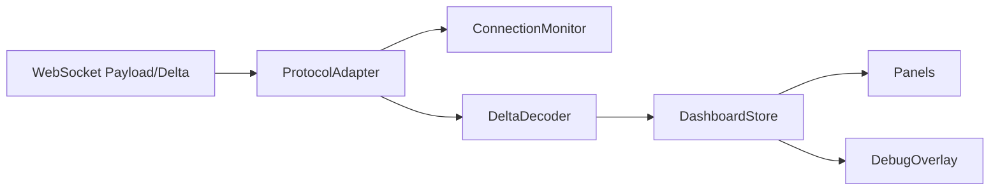

# L4 SOP — FRONTEND

> Version: 2026-03-11
> Layer: L4 UI Runtime

## 1. Responsibility

L4 负责消费 L3 协议数据并稳定渲染决策面板、风险状态与诊断信息。

## 2. Architecture



## 3. Runtime Rules

- 协议层和渲染层解耦
- Store 是前端状态单一事实源
- 组件通过 selector 精准订阅
- 连接与历史端点必须由环境变量驱动（`VITE_L4_WS_URL`、`VITE_L4_API_BASE`），禁止在入口硬编码地址
- 模块切换必须由显式开关控制（`VITE_L4_ENABLE_CENTER_V2`、`VITE_L4_ENABLE_RIGHT_V2`、`VITE_L4_ENABLE_LEFT_V2`），并保留稳定回退路径
- Center 图表入口必须通过 `ChartEngineAdapter` 抽象创建，当前生产引擎键固定 `lightweight`
- Right 面板入口必须通过 `RightPanel` 边界组件切换 `v2/stable` 路径；`stable` 路径仅接收 payload 派生的 typed contracts，不得依赖 Center/Left 内部实现
- Right stable 路径的状态→颜色映射必须先经过 `rightPanelModel` 总线归一化（`tacticalTriad/skewDynamics/mtfFlow/activeOptions/netGex`），组件层不得反向恢复后端样式 token。
- Left 面板入口必须通过 `LeftPanel` 边界组件切换 `v2/stable` 路径；`stable` 路径仅接收 payload 派生的 typed contracts，并通过本地视觉映射防止后端样式字段倒灌

## 4. Contract Consumption Rules

- `payload.timestamp/data_timestamp` 按 L0 数据时间解释
- `heartbeat_timestamp` 按链路心跳解释
- 右栏模型必须先 normalize 再渲染
- 亚洲盘语义必须保持一致：`红=涨/多头(BULLISH)`，`绿=跌/空头(BEARISH)`；`NET GEX`、`Call/Put Wall` 的颜色映射必须由状态归一化模块统一管理，组件不得各自反向硬编码
- 方向色 token 治理：`market.up/down` 是唯一方向源；`accent.red/green` 必须分别与 `market.up/down` 对齐，`text-market-*` 与 `text-accent-*` 只允许同向别名，不得出现反向映射。
- Wall 展示治理：Center/Left 的 CALL WALL 必须使用 market.up(红)，PUT WALL 必须使用 market.down(绿)，未知标签必须回退中性色，禁止默认归入 PUT 语义。
- `ActiveOptions` 必须在 model 层收敛 `flow_direction/flow_intensity/flow_color`：无效值回退到亚洲语义白名单（BULLISH→`text-accent-red`，BEARISH→`text-accent-green`，NEUTRAL→`text-text-secondary`）
- `ActiveOptions` 的 `FLOW` 方向判定必须“数值符号优先于后端 direction/color 文本”；当 `flow<0` 时颜色必须强制为 `text-accent-green`，不得出现红/灰混色
- `ActiveOptions` 合同中 `flow_score` 是 DEG 分数，不参与 `FLOW` 配色；配色只跟随 `flow`（USD signed amount）与其显示文本
- `ActiveOptions` 的 `FLOW` 展示文本必须与标准化后的 `flow` 数值同号；`flow=0` 时必须展示中性 `$0`，禁止出现 `-$0/+ $0` 等 signed-zero 文本
- `ActiveOptions` 的发光样式必须由前端基于 `flow_intensity/is_sweep` 本地白名单生成，禁止直接信任后端 `flow_glow` 字符串
- `ActiveOptions` 必须始终渲染固定 5 行；当后端异常少发时前端 model 必须补齐占位行，禁止面板高度跳变
- `ActiveOptions` 列表排序必须在 model 层硬切为 `VOL` 降序（同量级依次比较 `turnover`、`impact_index`，再回退输入序），组件不得恢复 OFII/impact 旧排序语义
- `ActiveOptions` 上游（shared runtime service）榜单截断口径必须与前端一致：`VOL desc -> turnover desc -> impact_index desc -> stable key(symbol/strike/type)`，禁止再以 `impact_index` 作为 Top5 截断主键。
- `ActiveOptions` 上游入参归一化必须保证可用成交量：当 `volume<=0` 且存在 `current_volume>0` 时，必须回退使用 `current_volume`（取整）参与 VOL 排序与门槛过滤。
- `ActiveOptions` 上游发布必须启用 3 tick 签名确认门控；候选 Top5 签名连续 3 tick 一致才允许替换当前榜单，首次无历史榜单可立即提交。
- `ActiveOptions` 3 tick 门控仅用于“换榜”（签名变化）确认；当签名不变时，`volume/flow/impact` 等数值必须每 tick 刷新，禁止冻结同榜单数值。
- `dashboardStore` 不得将 `ui_state.active_options` 作为 sticky key；当后端发送 `null/[]` 时必须按显式更新清空，禁止保留旧榜单。
- `ActiveOptions` 的占位行由 `is_placeholder=true` 标识，显示文案统一 `—`，且不得渲染方向色条/发光样式
- `ActiveOptions` 当 5 行全部为占位行时，右上角状态必须显示 `DEGRADED`；只要存在至少 1 行真实合约则必须显示 `TOP BY VOL`，禁止在空数据降级阶段误报活跃榜单。
- `ActiveOptions` 行稳定键优先使用 `slot_index`（1..5），避免跨帧重排抖动
- `DecisionEngine` 禁止渲染 `fused_signal.explanation` 文案（包括 tooltip/title）；guard 说明仅保留在后端审计与诊断链路，不在前端主视图展示
- `DecisionEngine` 的 GEX badge 必须与 `ui_state.micro_stats.net_gex` 同源（label+badge）；仅当该字段缺失时允许回退 `fused_signal.gex_intensity`
- `MtfFlow` 必须仅消费纯状态字段（`state=-1|0|1` + 物理标量），不得消费后端样式字段
- `MtfFlow` 的颜色/边框/动画必须由前端白名单 `Record<FlowState, VisualTokenSet>` 本地映射生成
- 对脏 payload 中的 `color/red/green/dot_color/text_color/border/animate/align_color` 必须忽略，禁止视觉状态倒灌
- `TacticalTriad` / `SkewDynamics` 的视觉 token 必须由前端 model 基于状态标签本地生成，组件不得直接信任后端 class token。`TacticalTriad` 强度白名单固定为 `EXTREME/HIGH/MEDIUM/LOW`（不兼容 `MODERATE`）；状态词白名单必须覆盖 L3 tactical labels（如 `BUY/SELL/TOXIC/FLIP`），未知词统一回落中性。`S-VOL` 若收到占位状态 `S-VOL` 且存在有效 `sub_label/value`，前端必须推导为可交易态（`GRIND/FLIP/TOXIC/STBL`），禁止在状态位显示占位词。`SkewDynamics` 阈值与公式来源固定为 L3（`rr25_call_minus_put` + `skew_speculative_max/skew_defensive_min`）；L4 只允许白名单状态（`SPECULATIVE/DEFENSIVE/NEUTRAL/UNAVAILABLE`）并负责本地 token 映射，未知状态硬切 `NEUTRAL`。
- `AtmDecayChart` 时间窗口初始化必须固定到当日 ET `09:30-16:00`，不得因本地 ring buffer 裁剪导致只显示午后片段
- `AtmDecayChart` 交互必须采用 Focus+Context：曲线命中时仅高亮命中家族（PUT/CALL/STRADDLE），其他家族临时隐藏，离开图表后复位
- `AtmDecayChart` 在 `displayMode=both` 时必须“同族双线聚焦”：命中某家族后，raw+smoothed 同时高亮；非命中家族四条线同步隐藏
- `AtmDecayChart` hover 判定必须严格以 TradingView 命中结果为准：仅当 `point` 合法且 `hoveredSeries` 映射到家族时才允许高亮
- `AtmDecayChart` 禁止“最近线推断”与“上一焦点黏性”作为高亮触发条件；`hoveredSeries` 缺失时必须立即清空焦点
- `AtmDecayChart` 的 `point` 合法性必须满足有限坐标（`x/y` 均为 finite number）；`NaN/Inf` 一律视为无效 point 并清空焦点，禁止残留高亮态
- `AtmDecayChart` 聚焦态禁止通过加粗线宽制造强调；强调仅允许通过非焦点去强调（隐藏或降权视觉）实现
- `AtmDecayChart` 在 `data=[]` 或过滤后无可渲染点（如跨日切换后仅剩非交易时段数据）时，必须同步清空 hover 焦点并重置初始化标记，避免下一批数据复用旧焦点状态
- `AtmDecayChart` 在 `init/update/interaction/resize` 任一阶段发生图表引擎异常时，必须进入显式 degraded 模式并执行 chart runtime teardown；degraded 后禁止继续执行图表副作用，但不得阻断 L4 其余模块渲染与广播消费链路
- 冷启动历史拉取 `/api/atm-decay/history` 必须使用字段投影（最小集：`timestamp,straddle_pct,call_pct,put_pct,strike_changed`），禁止传输完整行字段到浏览器
- 历史接口默认以 `schema=v2`（columnar-json）消费；`schema=v1` 仅用于兼容/回放验证
- 前端对 columnar 包络仅负责解码为对象行，不得改变既有图表/store 业务语义
- `dashboardStore` 的 sticky merge 与 `atmHistory` 必须按 ET 交易日隔离；跨日不得保留旧帧或旧日历史点。
- `dashboardStore.smartMergeUiState` 对 `wall_migration/depth_profile` 必须采用“空数组显式清空”语义；仅 `null/undefined`（字段缺失）允许 sticky 兜底，避免与 `GexStatusBar` 同 tick 口径漂移。
- Left `stable` 适配层必须优先消费 canonical wall 行字段（`label/strike/history/lights`），并兼容 legacy 字段（`type_label/current/h1/h2`），禁止在 stable 路径锁死旧合同。
- `WallMigration` 当前墙位数值（`CALL/PUT` 的 `strike`）必须以 `gamma_walls.call_wall/put_wall` 为 canonical source；`wall_migration` 仅承载迁移状态与历史上下文，不得反向覆盖主墙位数值。
- Left `MicroStats.wall_dyn` 的 badge 必须由前端本地状态语义归一化（与 `WallMigration` 一致）生成，禁止直接信任后端 badge：`RETREAT/BREACH/COLLAPSE -> amber`，`DECAY/SIEGE/PINCH -> neutral`，`REINFORCED` 按方向映射红/绿；未知/未收录状态必须硬切为 `neutral`，不得回退后端原始 badge。

### 4.1 Right Panel Typed Contract

禁止弱类型直读关键字段:

- `TacticalTriad`
- `SkewDynamics`
- `MtfFlow`
- `ActiveOptions`

要求:

- `payload -> store -> model -> component` 链路回归可测

## 5. Connection & Alert Rules

- 文本帧到达必须刷新 keepalive
- `STALLED` 不等同 `DISCONNECTED`
- DebugOverlay 必须展示 `shm_stats` 关键键
- ProtocolAdapter 必须记录消息处理链路 RUM：`markMsgReceived`、`markMsgProcessed`、`recordReconnect`

## 6. Boundary Rules

- L4 不导入后端运行时代码
- L4 只通过协议契约消费 L3 数据

## 7. Verification

```powershell
npm --prefix l4_ui run test
npm --prefix l4_ui run dev -- --host 0.0.0.0 --port 5173
```
