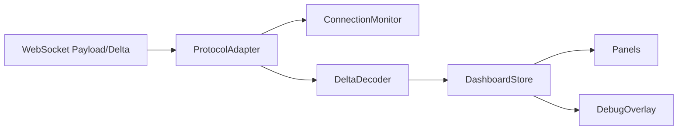

# L4 SOP — FRONTEND

> Version: 2026-03-10
> Layer: L4 UI Runtime

## 1. Responsibility

L4 负责消费 L3 协议数据并稳定渲染决策面板、风险状态与诊断信息。

## 2. Architecture



## 3. Runtime Rules

- 协议层和渲染层解耦
- Store 是前端状态单一事实源
- 组件通过 selector 精准订阅

## 4. Contract Consumption Rules

- `payload.timestamp/data_timestamp` 按 L0 数据时间解释
- `heartbeat_timestamp` 按链路心跳解释
- 右栏模型必须先 normalize 再渲染
- 亚洲盘语义必须保持一致：`红=涨/多头(BULLISH)`，`绿=跌/空头(BEARISH)`；`NET GEX`、`Call/Put Wall` 的颜色映射必须由状态归一化模块统一管理，组件不得各自反向硬编码
- `ActiveOptions` 必须在 model 层收敛 `flow_direction/flow_intensity/flow_color`：无效值回退到亚洲语义白名单（BULLISH→`text-accent-red`，BEARISH→`text-accent-green`，NEUTRAL→`text-text-secondary`）
- `ActiveOptions` 的 `FLOW` 方向判定必须“数值符号优先于后端 direction/color 文本”；当 `flow<0` 时颜色必须强制为 `text-accent-green`，不得出现红/灰混色
- `ActiveOptions` 合同中 `flow_score` 是 DEG 分数，不参与 `FLOW` 配色；配色只跟随 `flow`（USD signed amount）与其显示文本
- `ActiveOptions` 必须始终渲染固定 5 行；当后端异常少发时前端 model 必须补齐占位行，禁止面板高度跳变
- `ActiveOptions` 的占位行由 `is_placeholder=true` 标识，显示文案统一 `—`，且不得渲染方向色条/发光样式
- `ActiveOptions` 行稳定键优先使用 `slot_index`（1..5），避免跨帧重排抖动
- `DecisionEngine` 禁止渲染 `fused_signal.explanation` 文案（包括 tooltip/title）；guard 说明仅保留在后端审计与诊断链路，不在前端主视图展示
- `DecisionEngine` 的 GEX badge 必须与 `ui_state.micro_stats.net_gex` 同源（label+badge）；仅当该字段缺失时允许回退 `fused_signal.gex_intensity`
- `MtfFlow` 必须仅消费纯状态字段（`state=-1|0|1` + 物理标量），不得消费后端样式字段
- `MtfFlow` 的颜色/边框/动画必须由前端白名单 `Record<FlowState, VisualTokenSet>` 本地映射生成
- 对脏 payload 中的 `color/red/green/dot_color/text_color/border/animate/align_color` 必须忽略，禁止视觉状态倒灌
- `TacticalTriad` / `SkewDynamics` 的视觉 token 必须由前端 model 基于状态标签本地生成，组件不得直接信任后端 class token。
- `AtmDecayChart` 时间窗口初始化必须固定到当日 ET `09:30-16:00`，不得因本地 ring buffer 裁剪导致只显示午后片段
- 冷启动历史拉取 `/api/atm-decay/history` 必须使用字段投影（最小集：`timestamp,straddle_pct,call_pct,put_pct,strike_changed`），禁止传输完整行字段到浏览器
- 历史接口默认以 `schema=v2`（columnar-json）消费；`schema=v1` 仅用于兼容/回放验证
- 前端对 columnar 包络仅负责解码为对象行，不得改变既有图表/store 业务语义
- `dashboardStore` 的 sticky merge 与 `atmHistory` 必须按 ET 交易日隔离；跨日不得保留旧帧或旧日历史点。

### 4.1 Right Panel Typed Contract

禁止弱类型直读关键字段:

- `TacticalTriad`
- `SkewDynamics`
- `MtfFlow`
- `ActiveOptions`

要求:

- `payload -> store -> model -> component` 链路回归可测

## 5. Connection & Alert Rules

- 文本帧到达必须刷新 keepalive
- `STALLED` 不等同 `DISCONNECTED`
- DebugOverlay 必须展示 `shm_stats` 关键键

## 6. Boundary Rules

- L4 不导入后端运行时代码
- L4 只通过协议契约消费 L3 数据

## 7. Verification

```powershell
npm --prefix l4_ui run test
npm --prefix l4_ui run dev -- --host 0.0.0.0 --port 5173
```
