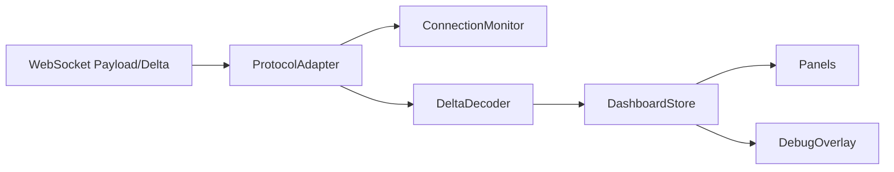

# L4 SOP — FRONTEND

> Version: 2026-04-21
> Layer: L4 UI Runtime

## 1. Responsibility

L4 负责消费 L3 协议数据并稳定渲染决策面板、风险状态与诊断信息。

## 2. Architecture


```mermaid
flowchart LR
  A[WebSocket Payload/Delta] --> B[ProtocolAdapter]
  B --> C[ConnectionMonitor]
  B --> D[DeltaDecoder]
  D --> E[DashboardStore]
  E --> F[Panels]
  E --> G[DebugOverlay]
```

## 3. Runtime Rules

- 协议层和渲染层解耦
- Store 是前端状态单一事实源
- 组件通过 selector 精准订阅
- 连接与历史端点必须由单一环境变量 `VITE_BACKEND_ORIGIN` 驱动（示例：`http://127.0.0.1:8001`）；该变量用于 Vite `/api` 与 `/ws` 代理上游
- 浏览器运行态必须使用同源端点：`apiBase=''`（请求 `/api/...`）与 `ws(s)://<current-frontend-host>/ws/dashboard`；禁止浏览器直连 `VITE_BACKEND_ORIGIN`
- `VITE_BACKEND_ORIGIN` 缺失或非法（非 http/https、包含 path/query/hash）时，前端启动必须 fast-fail；禁止 `window.location` 推导、`localhost` 默认值或任何 fallback
- `Vite serve` 是唯一允许依赖 `VITE_BACKEND_ORIGIN` 的前端启动面；`vite build` 不得因该变量缺失而阻断编译
- `l4_ui/scripts/dev-strict.mjs` 必须直接通过 Vite JS API 创建 dev server，禁止再外壳到 `vite` CLI；Windows 受限上下文下需要绕开 CLI config-loader 对 `esbuild` 原生子进程的额外依赖
- `VITE_L4_WS_URL` 与 `VITE_L4_API_BASE` 已退出运行合同；若仍被设置，运行时必须抛错并阻断启动
- 模块切换必须由显式开关控制（`VITE_L4_ENABLE_CENTER_V2`、`VITE_L4_ENABLE_RIGHT_V2`、`VITE_L4_ENABLE_LEFT_V2`）
- 全局布局必须使用单一路径的布局令牌缩放：固定设计基准 `1920x1080`，按 `min(width_ratio,height_ratio)` 同步窗口/浏览器缩放，并限制在 `50%~125%`
- 禁止对整棵应用 DOM 使用 `transform: scale(...)` + 反向 `width/height` 补偿；缩放只允许通过布局变量驱动左右栏宽度、关键浮层宽度和定位偏移
- L4 不得尝试按“物理主屏/副屏设备身份”分支；浏览器运行时唯一允许的定向优化依据是当前窗口 viewport 尺寸
- 布局必须按 viewport 档位自动切换：
  - `primary_standard`: `width > 1366` 且 `height > 768`
  - `secondary_compact`: `width <= 1366` 或 `height <= 768`
- `primary_standard` 与 `secondary_compact` 必须分别拥有独立布局 token 集，至少覆盖左右栏宽度、Header 高度与间距、GEX bar 宽度、中心浮层偏移、Right/Left panel padding 与关键字号
- `secondary_compact` 布局收敛原则必须是“装饰先让位，核心信息后让位”：允许扩大左右栏信息 rail、收紧非核心 padding，但禁止通过改写核心表格/核心监控模块结构来掩盖 token 失衡
- 缩放百分比继续只用于驱动布局 token 计算，不得再作为 Header 文案状态输出；右侧 masthead 诊断簇仅保留 `TACTICAL OFFENSIVE` 与 `RUST`
- Center `Header` 禁止依赖 `scale`、`flex-shrink`、`ellipsis` 或内部换行来硬塞信息；必须使用嵌套分组骨架：左组固定承载 `SPX SENTINEL / 时间 / 状态 / SPY / spot`，中组承载 `IV` 与附属波动 badge，右组独立承载 `RDS LIVE`
- Center `Header` 组内元素只允许通过紧凑 gap 控制间距，禁止在组内使用 `justify-between`、`flex-1` 或其他会破坏区块感的拉伸策略
- Center `Header` 小屏收敛必须通过 container-query 触发物理级裁剪：`IV {pct}` 主值是 Tier-0 指标，任何 viewport 下都不得隐藏；只允许依次隐藏 `vol micro`、`vol velocity`、整块附属波动 badge；`RDS LIVE` 保持保留，禁止把左组核心区挤压变形
- Center `Header` 的视觉层级必须保持机构终端风格：`IV {pct}` 是唯一中心主锚点，品牌/时间/状态属于次级信息，右侧 utility（如 offense/scale/rust）必须弱化到诊断层，不得与 IV 争抢主视觉
- Center `Header` 的 IV 附属 detail badge 必须保持可读性下限：默认 viewport 下禁止把 regime/micro token 压到接近调试字级别；应优先提高字号/行高并提前触发裁剪，而不是维持不可读的小字
- Center `Header` 的 `SPY` 主价必须提供 broker-style last-tick 反馈：按亚洲盘语义执行 `红=涨`、`绿=跌`，仅数值本身响应 tick 方向并触发短促无位移的高亮，不得把该动态扩散到整个 header cluster
- Center 图表入口必须通过 `ChartEngineAdapter` 抽象创建，当前生产引擎键固定 `lightweight`
- Right 面板入口必须通过 `RightPanel` 边界组件切换 `v2/stable` 路径；`stable` 路径仅接收 payload 派生的 typed contracts，不得依赖 Center/Left 内部实现
- Right stable 路径的状态→颜色映射必须先经过 `rightPanelModel` 总线归一化（`tacticalTriad/skewDynamics/mtfFlow/activeOptions/netGex`），组件层不得反向恢复后端样式 token。
- Left 面板入口必须通过 `LeftPanel` 边界组件切换 `v2/stable` 路径；`stable` 路径仅接收 payload 派生的 typed contracts，并通过本地视觉映射防止后端样式字段倒灌

## 4. Contract Consumption Rules

- `payload.timestamp/data_timestamp` 按 L0 数据时间解释
- `heartbeat_timestamp` 按链路心跳解释
- Header `SPY` 只能消费顶层 `payload.spot`；当 backend 进入 live spot fast lane 后，L4 必须接受一秒内多次 `spot/version/data_timestamp` 更新，禁止再假设 `SPY` 只会按 1Hz 变化
- 右栏模型必须先 normalize 再渲染
- Right Panel 诊断型数值卡片（如 raw Greek）应优先从 `agent_g.data.micro_structure.micro_structure_state.*` 派生，避免扩大 `ui_state` presenter 合同
- Right Panel `MM FLOW` 卡片必须优先消费 `agent_g.data.mm_flow`，仅在缺失时回退 `agent_g.data.fused_signal.mm_flow`；L4 仅负责展示映射，不得在组件层重算 Delta/Gamma/OI 指标
- 标题栏 IV 主值必须继续消费 `spy_atm_iv`；动态补充信息单独消费 `agent_g.data.header_volatility`
- 标题栏动态 token 顺序固定为 `R{ivr}`、`P{ivp}`、`1D {ratio}`、`VX {ratio}`、`β {state}`
- 标题栏动态 token 缺值时必须显示 `—`，禁止沿用旧值 sticky
- 亚洲盘语义必须保持一致：`红=涨/多头(BULLISH)`，`绿=跌/空头(BEARISH)`；`NET GEX`、`Call/Put Wall` 的颜色映射必须由状态归一化模块统一管理，组件不得各自反向硬编码
- 方向色 token 治理：`market.up/down` 是唯一方向源；`accent.red/green` 必须分别与 `market.up/down` 对齐，`text-market-*` 与 `text-accent-*` 只允许同向别名，不得出现反向映射。
- Wall 展示治理：Center/Left 的 CALL WALL 必须使用 market.up(红)，PUT WALL 必须使用 market.down(绿)，未知标签必须回退中性色，禁止默认归入 PUT 语义。
- `ActiveOptions` 非占位行必须携带完整后端契约字段：`flow_direction/flow_intensity/flow_color/flow_glow`
- `ActiveOptions` model 层必须执行硬校验：`flow` 符号与 `flow_direction` 一致；`flow_color` 与 `flow_direction` 一致；不一致直接抛错并中断该帧消费
- `ActiveOptions` 合同中 `flow_score` 是 DEG 分数，不参与 `FLOW` 配色；配色只跟随 `flow`（USD signed amount）与其显示文本
- `ActiveOptions` 的 `FLOW` 展示文本必须与标准化后的 `flow` 数值同号；`flow=0` 时必须展示中性 `$0`，禁止出现 `-$0/+ $0` 等 signed-zero 文本
- `ActiveOptions` 的 `IMP` 展示必须使用前端紧凑数字单位（`K/M/B/T`）且不得带 `$` 前缀；固定两位小数显示禁止恢复
- `ActiveOptions` 必须消费后端 `flow_glow` 字段（允许空字符串）；前端不得本地派生/回退 glow token
- `ActiveOptions` 必须始终渲染固定 5 行；当后端异常少发时仅允许补齐标准占位行（`is_placeholder=true`），禁止伪造真实合约行
- `ActiveOptions` 协议消费允许 `ui_state.active_options` 返回 `0..5` 行；`0` 行在盘前/无合格流窗口属于合法状态，L4 必须通过 model 层补齐到固定 5 行展示
- `ActiveOptions` 前端不再消费 fallback 字段；`fallback_reason`、`is_synthetic_fallback` 已退出运行合同
- `ActiveOptions` 前端 model 层禁止二次排序；必须严格保持后端榜单顺序与槽位语义，组件不得恢复 OFII/impact 旧排序语义。
- `ActiveOptions` 上游（shared runtime service）是唯一排序 owner：`VOL desc -> turnover desc -> impact_index desc -> stable key(symbol/strike/type)`；前端仅消费结果，不得重排。
- `ActiveOptions` 上游入参与排序口径必须硬切到当日累计成交量：`VOL` 排序只允许使用 `volume`；`current_volume` 禁止用于排序、禁止兜底回填。
- `ActiveOptions` 上游发布必须启用 3 tick 签名确认门控；候选 Top5 签名连续 3 tick 一致才允许替换当前榜单，首次无历史榜单可立即提交。
- `ActiveOptions` 3 tick 门控仅用于“换榜”（签名变化）确认；当签名不变时，`volume/flow/impact` 等数值必须每 tick 刷新，禁止冻结同榜单数值。
- `dashboardStore` 不得将 `ui_state.active_options` 作为 sticky key；当后端发送 `null/[]` 时必须按显式更新清空，禁止保留旧榜单。
- `ActiveOptions` 的占位行由 `is_placeholder=true` 标识，显示文案统一 `—`，且不得渲染方向色条/发光样式
- `ActiveOptions` 当 5 行全部为占位行时，右上角状态必须显示 `DEGRADED`；只要存在至少 1 行真实合约则必须显示 `TOP BY VOL`，禁止在空数据降级阶段误报活跃榜单。
- `ActiveOptions` 当任一真实行 `flow_signal_state=DEGRADED` 时，右上角状态必须显示 `DEGRADED`（显式信号降级），禁止静默显示 `$0` 且继续标记 `TOP BY VOL`。
- `ActiveOptions` 行稳定键优先使用 `slot_index`（1..5），避免跨帧重排抖动
- `ActiveOptions` 若接收到重复/越界 `slot_index`，model 层必须在保持后端行顺序前提下执行 1..5 去重补位，保证 DOM key 唯一且始终覆盖完整槽位集合
- `DecisionEngine` 禁止渲染 `fused_signal.explanation` 文案（包括 tooltip/title）；guard 说明仅保留在后端审计与诊断链路，不在前端主视图展示
- `DecisionEngine` 的 GEX badge 必须与 `ui_state.micro_stats.net_gex` 同源（label+badge）；仅当该字段缺失时允许回退 `fused_signal.gex_intensity`
- `DecisionEngine` 右栏进攻区禁止使用横向进度/状态条；状态强弱通过文字、数值、badge、dot 和颜色表达
- `MtfFlow` 的 kinetic/contraction 强度展示必须使用紧凑滚动条（scrollbar/gauge）可视化；不得只显示百分比数字
- `MtfFlow` 必须仅消费纯状态字段（`state=-1|0|1` + 物理标量），不得消费后端样式字段
- `MtfFlow` 的颜色/边框/动画必须由前端白名单 `Record<FlowState, VisualTokenSet>` 本地映射生成
- 对脏 payload 中的 `color/red/green/dot_color/text_color/border/animate/align_color` 必须忽略，禁止视觉状态倒灌
- `TacticalTriad` / `SkewDynamics` 的视觉 token 必须由前端 model 基于状态标签本地生成，组件不得直接信任后端 class token。`TacticalTriad` 强度白名单固定为 `EXTREME/HIGH/MEDIUM/LOW`（不兼容 `MODERATE`）；状态词白名单必须覆盖 L3 tactical labels（如 `BUY/SELL/TOXIC/FLIP`），未知词统一回落中性。`S-VOL` 若收到占位状态 `S-VOL` 且存在有效 `sub_label/value`，前端必须推导为可交易态（`GRIND/FLIP/TOXIC/STBL`），禁止在状态位显示占位词。`SkewDynamics` 阈值与公式来源固定为 L3（`rr25_call_minus_put` + `skew_rr25_defensive_max/skew_rr25_speculative_min`）；L4 只允许白名单状态（`SPECULATIVE/DEFENSIVE/NEUTRAL/UNAVAILABLE`）并负责本地 token 映射，未知状态硬切 `NEUTRAL`。
- `AtmDecayChart` 时间窗口初始化必须固定到当日 ET `09:30-16:00`，不得因本地 ring buffer 裁剪导致只显示午后片段
- `AtmDecayChart` 交互必须采用 Focus+Context：曲线命中时仅高亮命中家族（PUT/CALL/STRADDLE），其他家族临时隐藏，离开图表后复位
- `AtmDecayChart` 在 `displayMode=both` 时必须“同族双线聚焦”：命中某家族后，raw+smoothed 同时高亮；非命中家族四条线同步隐藏
- `AtmDecayChart` hover 判定必须严格以 TradingView 命中结果为准：仅当 `point` 合法且 `hoveredSeries` 映射到家族时才允许高亮
- `AtmDecayChart` 禁止“最近线推断”与“上一焦点黏性”作为高亮触发条件；`hoveredSeries` 缺失时必须立即清空焦点
- `AtmDecayChart` 的 `point` 合法性必须满足有限坐标（`x/y` 均为 finite number）；`NaN/Inf` 一律视为无效 point 并清空焦点，禁止残留高亮态
- `AtmDecayChart` 聚焦态禁止通过加粗线宽制造强调；强调仅允许通过非焦点去强调（隐藏或降权视觉）实现
- `AtmDecayChart` 在 `data=[]` 或过滤后无可渲染点（如跨日切换后仅剩非交易时段数据）时，必须同步清空 hover 焦点并重置初始化标记，避免下一批数据复用旧焦点状态
- `AtmDecayChart` 在 `init/update/interaction/resize` 任一阶段发生图表引擎异常时，必须进入显式 degraded 模式并执行 chart runtime teardown；degraded 后禁止继续执行图表副作用，但不得阻断 L4 其余模块渲染与广播消费链路
- `AtmDecayChart` 在 `document.visibilityState='hidden'` 时可以暂停同步，但 `visibilitychange -> visible` 必须重放当前 store 最新 ATM 状态；禁止依赖“下一笔 live tick”才能补图
- 冷启动历史拉取 `/api/atm-decay/history` 必须使用字段投影（最小集：`timestamp,straddle_pct,call_pct,put_pct,strike_changed`），禁止传输完整行字段到浏览器
- 历史接口默认以 `schema=v2`（columnar-json）消费；`schema=v1` 仅用于兼容/回放验证
- 冷启动 history 请求非 2xx、响应解码失败或空历史在 strict 模式下必须显式报错并可见告警；禁止静默吞错或假数据补齐
- `/api/atm-decay/history` 视为后端已净化的单调序列：前端不得自行容忍 future/out-of-order ATM points 来“修图”，若出现逆序或未来点应视为后端违约并回查 storage sanitizer
- 盘后 ATM replay 验证必须继续复用同一个 `/api/atm-decay/history` + `/ws/dashboard` 消费路径，前端不得引入 replay-only 分支；若 history 存在且曲线非平台化，TradingView 应在 cold boot 后恢复显示而不是长期 `-- PENDING`
- 前端对 columnar 包络仅负责解码为对象行，不得改变既有图表/store 业务语义
- `dashboardStore` 的 sticky merge 与 `atmHistory` 必须按 ET 交易日隔离；跨日不得保留旧帧或旧日历史点。
- `dashboardStore` 对 live `atmHistory` 的交易日隔离必须使用显式 `atmHistoryTradeDateKey/atmHistoryLastTimestamp` 常量时间维护；禁止在 `applyFullUpdate/applyMergedPayload` 热路径上对整段 history 反复执行 ET 日期解析或 `filter()`。
- `dashboardStore` 对 live ATM 去重必须覆盖当前交易日整段 active history，而不是只比较 tail timestamp；重连/init snapshot 重发旧点时不得把旧 timestamp 追加回图表序列
- 浏览器性能采样不得依赖渲染 DebugOverlay 本身；L4 profiling 必须支持无界面开关（例如 `l4:set_profiling_enabled` / `mockL4.setProfiling()`），避免测量链路污染被测 CPU。
- 即使 compute loop 因重复 `snapshot_version` 跳过 L1/L2，前端也应继续通过既有 `atm` payload 消费到新的 live ATM sample；若 `dashboard_delta` 长期不含 `changes.atm`，应优先排查后端 dedup/live continuity，而不是在 L4 伪造中间点
- `dashboard_delta` 仅含 `heartbeat_timestamp` 时，前端必须将其解释为 transport liveness；禁止把 heartbeat-only 帧误判为指标刷新
- `dashboardStore.smartMergeUiState` 对 `wall_migration/depth_profile` 必须采用“空数组显式清空”语义；仅 `null/undefined`（字段缺失）允许 sticky 兜底，避免与 `GexStatusBar` 同 tick 口径漂移。
- `App.tsx` 在 ATM history cold-boot hydrate 成功时必须打印一次 `[L4 ATM]` 日志，最少包含 `rows / last timestamp / straddle / call / put`，用于确认 TradingView 曲线数据已进入浏览器侧
- Left `stable` 适配层必须优先消费 canonical wall 行字段（`label/strike/history/lights`），并兼容 legacy 字段（`type_label/current/h1/h2`），禁止在 stable 路径锁死旧合同。
- `WallMigration` 当前墙位数值（`CALL/PUT` 的 `strike`）必须以 `gamma_walls.call_wall/put_wall` 为 canonical source；`wall_migration` 仅承载迁移状态与历史上下文，不得反向覆盖主墙位数值。
- `WallMigration` 必须保持 `CALL/PUT` 双行横向结构；禁止改造成纵向卡片或改变行语义
- `WallMigration` 行内列宽必须随容器响应式重分配：`h1/h2/current` 三个 strike 容器必须使用等份自适应轨道，禁止按 `current` 文本长度或内容给单列特权扩张；`state` 保持独立尾列并允许先收缩截断
- `WallMigration` 的 `h1/h2/current` strike 展示必须使用紧凑整数标签（如 `711`），不得在该模块继续显示 `.00` 小数尾巴；该规则仅限 `WallMigration`，不得外溢到 Header/GEX Bar 等其他价格展示模块
- Left `MicroStats.wall_dyn` 的 badge 必须由前端本地状态语义归一化（与 `WallMigration` 一致）生成，禁止直接信任后端 badge：`RETREAT/BREACH/COLLAPSE -> amber`，`DECAY/SIEGE/PINCH -> neutral`，`REINFORCED` 按方向映射红/绿；未知/未收录状态必须硬切为 `neutral`，不得回退后端原始 badge。
- `ActiveOptions` 必须维持 canonical table 结构与表头顺序（`# / SYM / T / STRIKE / IMP / VOL / FLOW`）；紧凑档若出现挤压，必须优先修正 rail/token/padding，而不是改成 list/card 结构

### 4.1 Right Panel Typed Contract

禁止弱类型直读关键字段:

- `TacticalTriad`
- `SkewDynamics`
- `MtfFlow`
- `ActiveOptions`
- `MmFlowCard`

要求:

- `payload -> store -> model -> component` 链路回归可测

## 5. Connection & Alert Rules

- 文本帧到达必须刷新 keepalive
- `STALLED` 不等同 `DISCONNECTED`
- DebugOverlay 必须展示 `shm_stats` 关键键
- ProtocolAdapter 必须记录消息处理链路 RUM：`markMsgReceived`、`markMsgProcessed`、`recordReconnect`
- DebugOverlay 还必须展示 quote-lane 诊断链路：`governor_telemetry.quote_lane.mode`、`last_source_gap_ms`、`source_event_count_1s`、`last_distinct_spot_gap_ms`、`distinct_spot_count_1s`，以及前端 RUM 的 `wire lag / msg->store / store->paint / source->paint`；其中 `source_*` 是 raw depth arrival cadence，`distinct_*` 是 midpoint 真变化 cadence；这些字段只用于观测，不得反向参与业务渲染逻辑

## 6. Boundary Rules

- L4 不导入后端运行时代码
- L4 只通过协议契约消费 L3 数据

## 7. Verification

```bash
npm --prefix l4_ui run test
$env:VITE_BACKEND_ORIGIN='http://127.0.0.1:8001'; npm --prefix l4_ui run dev -- --host 0.0.0.0 --port 5173
```

上述 `npm run dev` 仅用于前端局部调试，不构成系统整体健康证据；完整启动与最终复核必须通过 `.venv\Scripts\python.exe manage.py start-all` 完成。
