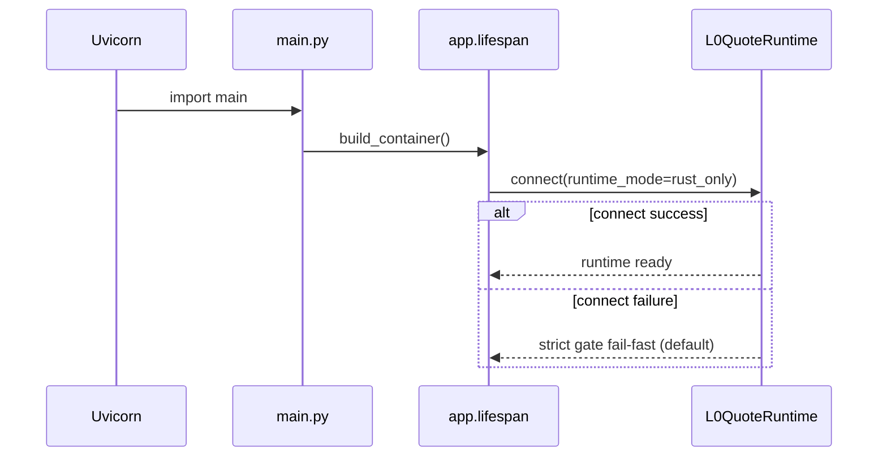

# SPY 0DTE Dashboard SOP — SYSTEM OVERVIEW

> Version: 2026-03-10
> Scope: L0/L1/L2/L3/L4 + app orchestration + shared services

## 1. Mission

系统目标是以机构级时效处理 SPY 0DTE 期权链路，要求在高噪声、高频环境下保持：

- 低延迟: L0 到 L4 连续链路稳定
- 强契约: 跨层字段与语义一致
- 可降级: 外部依赖失效时服务不中断
- 可审计: 每层有明确日志、指标和回归门禁

## 2. Runtime Architecture

```mermaid
flowchart LR
  subgraph L0["L0 Data Ingest"]
    L0A[LongPort WS/REST]
    L0B[Rust Ingest Gateway]
    L0C[RustQuoteRuntime]
    L0D[ChainStateStore]
    L0E[IV/Tier2/Tier3 Pollers]
  end

  subgraph L1["L1 Local Computation"]
    L1A[RustBridge SHM/Arrow]
    L1B[L1ComputeReactor]
    L1C[Greeks + Trackers]
    L1D[EnrichedSnapshot]
  end

  subgraph L2["L2 Decision Analysis"]
    L2A[FeatureStore]
    L2B[Signals]
    L2C[Fusion]
    L2D[GuardRails]
    L2E[DecisionOutput]
  end

  subgraph L3["L3 Output Assembly"]
    L3A[PayloadAssembler]
    L3B[UIStateTracker]
    L3C[Presenters]
    L3D[FieldDeltaEncoder]
    L3E[BroadcastGovernor]
  end

  subgraph L4["L4 Frontend"]
    L4A[ProtocolAdapter]
    L4B[DeltaDecoder]
    L4C[DashboardStore]
    L4D[Panels + DebugOverlay]
  end

  APP["app/* orchestration"]
  SHARED["shared/services/* neutral services"]

  L0 --> L1 --> L2 --> L3 --> L4
  APP -. wiring only .-> L0
  APP -. wiring only .-> L1
  APP -. wiring only .-> L2
  APP -. wiring only .-> L3
  SHARED -. reusable contracts/services .-> L2
  SHARED -. reusable contracts/services .-> L3
```



## 3. Hard Dependency Law

只允许单向依赖: `L0 -> L1 -> L2 -> L3 -> L4`。

### 3.1 Forbidden Reverse Imports

- `l2_decision` 禁止导入 `l3_assembly`、`l4_ui`
- `l3_assembly` 禁止导入 `l4_ui`
- `l3_assembly` 仅允许导入 `l2_decision.events/*`，禁止 `signals/*`、`agents/*`
- `l3_assembly/presenters/ui/*` 禁止导入 `l1_compute.analysis/*` 与 `l1_compute.trackers/*`
- `app/loops/*` 禁止跨层私有成员访问 (`obj._xxx`)

### 3.2 Enforcement

- Policy: `scripts/policy/layer_boundary_rules.json`
- Gate: `scripts/validate_session.ps1 -Strict`
- P0 审计要求: 必须支持全仓扫描，不仅扫描 `files_changed`

## 4. Contracts Across Layers

### 4.1 L0 -> L1

最小关键字段:

- `spot`
- `chain`
- `version` (单调递增)
- `as_of_utc` (L0 数据源时间)
- `rust_active`
- `shm_stats.status/head/tail`

### 4.2 L1 -> L2

`EnrichedSnapshot` 核心语义:

- `version` 必须透传 L0 快照版本
- `computed_at` 为计算时钟
- `extra_metadata.source_data_timestamp_utc` 绑定 L0 `as_of_utc`

### 4.3 L2 -> L3

`DecisionOutput` 核心语义:

- 决策信号 + 护栏结果
- `feature_vector` 必须包含关键 UI 消费字段（如 `skew_25d_normalized`）

### 4.4 L3 -> L4

Payload 核心语义:

- `timestamp/data_timestamp`: L0 源数据时间
- `broadcast_timestamp/heartbeat_timestamp`: L3 广播时钟
- `ui_state`: 前端唯一消费状态源
- `rust_active/shm_stats`: 诊断链路连续透传

## 5. Startup and Degraded Mode



关键要求:

- 默认 `longport_startup_strict_connectivity=true`：启动必须通过最小连通性预检，否则 fail-fast 终止进程启动。
- 当显式关闭 strict 开关时，Runtime 建连失败可降级运行，但必须输出结构化诊断日志。
- Runtime 建连失败需有限次退避重试后再判定失败（避免瞬时网络抖动直接进入长时间降级）。
- 降级模式必须有明确日志。
- 运维启动必须遵循 probe-first：先检查 `/health`、`5173`、`6380`，仅对 DOWN 组件执行启动，避免重复启动导致 `WinError 10048`。
- 当 `8001` 端口冲突时，先以 `/health` 判定是否已有健康实例在跑；仅在需要替换实例时才释放端口占用进程。
- LongPort Quote API 配额守卫必须持续生效:
  - 同时订阅 symbols <= 500（超限自动裁剪）
  - REST 调用频率 <= 10/s（配置超限时运行时钳制）
  - REST 并发 <= 5（配置超限时运行时钳制）
  - Symbol budget 必须支持 startup/steady 双阶段治理并在 `301607` 后自动回落 startup
  - 启动期重操作必须去冲击（refresh 间隔、warm-up 聚合、research 延后、Tier2/Tier3 延后）

## 6. Observability

推荐标准标记:

- `[Debug] L0 Fetch`
- `[L3 Assembler]`
- `[IVSync]`
- `shm_stats.status/head/tail`
- LongPort 建连阶段必须输出 attempt/退避信息，便于区分瞬时抖动与持续不可达

关键诊断端点:

- `/health`
- `/debug/persistence_status`
- `snapshot_version_iv_probe` 告警阈值必须由配置驱动（`snapshot_iv_probe_*`），禁止在探针逻辑中写死 tick/秒阈值
- 漂移告警启用推荐为“时间阈值 + 连续tick阈值”联合触发，避免 IV 平台期造成噪声误报

## 7. Verification Standard

### 7.1 Test Entry

- 所有 pytest 必须通过 `scripts/test/run_pytest.ps1`
- 缓存目录必须是 `tmp/pytest_cache`
- 禁止管理员上下文混跑

### 7.2 Minimum Regression Set

- `scripts/test/test_l0_l4_pipeline.py`
- 层间契约与 Presenter 相关回归
- 会话结束前 `scripts/validate_session.ps1 -Strict`

## 8. SOP Pack

本文档与以下文档共同构成强制 fast-load pack:

- `docs/SOP/L0_DATA_FEED.md`
- `docs/SOP/L1_LOCAL_COMPUTATION.md`
- `docs/SOP/L2_DECISION_ANALYSIS.md`
- `docs/SOP/L3_OUTPUT_ASSEMBLY.md`
- `docs/SOP/L4_FRONTEND.md`

## 9. Runtime Commands

```powershell
# probe first (do not blindly restart)
try { (Invoke-WebRequest http://127.0.0.1:8001/health -UseBasicParsing -TimeoutSec 3).StatusCode } catch {}
try { (Invoke-WebRequest http://127.0.0.1:5173 -UseBasicParsing -TimeoutSec 3).StatusCode } catch {}
Get-NetTCPConnection -LocalPort 6380 -State Listen -ErrorAction SilentlyContinue

# backend strict (default)
$env:PYTHONPATH='.'
python -m uvicorn main:app --host 0.0.0.0 --port 8001

# backend degraded (only when startup connectivity fails)
$env:PYTHONPATH='.'
$env:LONGPORT_STARTUP_STRICT_CONNECTIVITY='false'
$env:LONGBRIDGE_STARTUP_STRICT_CONNECTIVITY='false'
python -m uvicorn main:app --host 0.0.0.0 --port 8001

# frontend
npm --prefix l4_ui run dev -- --host 0.0.0.0 --port 5173

# release 8001 only when replacement is required
$pid8001 = (Get-NetTCPConnection -LocalPort 8001 -State Listen | Select-Object -First 1).OwningProcess
Get-Process -Id $pid8001
Stop-Process -Id $pid8001 -Force

# strict session gate
powershell -ExecutionPolicy Bypass -File scripts/validate_session.ps1 -Strict
```
