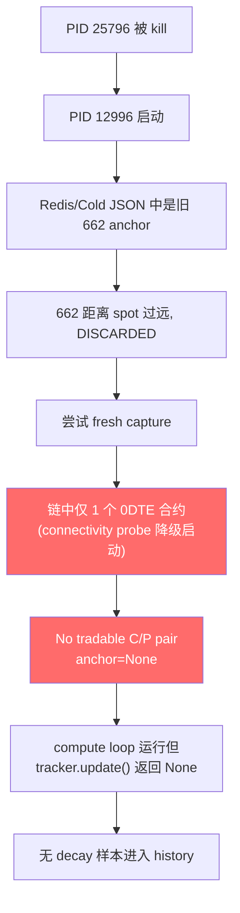

# ATM Decay Post-Lock Sample Missing — Root Cause Exploration

## 问题描述
新锚点 661 于 `11:08:53 ET` 锁定后，`/api/atm-decay/history` 始终返回 `count=0`，无 decay 样本进入 history。

## 诊断结论

> [!CAUTION]
> **核心发现：当前运行的 backend (PID 12996) 从未成功锁定 661 anchor。磁盘上的 661 anchor 是残留文件，不代表当前运行时状态。**

---

## 证据链

### 1. 当前 backend 进程状态
| 项目 | 值 |
|---|---|
| PID | 12996 |
| 启动时间 | 2026-03-25 11:08:36 ET |
| 磁盘 anchor 文件 | [atm_20260325.json](file:///e:/US.market/Option_v3/data/atm_decay/atm_20260325.json) → strike=661 |
| 系列文件 | `atm_series_20260325.jsonl` **不存在** |
| 日志中 `ANCHOR LOCKED` | **未出现** |
| 日志中 `Intraday startup bootstrap` | **未出现** |
| 日志中 `opening tick suppressed` | **未出现** |

### 2. PID 12996 启动日志时间线

```
1. initialize_tracker() 加载 Redis/Cold JSON → 读到旧 662 anchor
2. Redis  662 anchor → spot=None → deferred restore
3. Cold   662 anchor → spot=None → deferred restore
4. Deferred 662 → spot=658.60 → distance=3.40 > max=3.00 → DISCARDED
5. Deferred 662 → spot=657.76 → distance=4.24 > max=3.00 → DISCARDED
6. bootstrap_intraday_anchor() → select_opening_anchor()
   → "No tradable same-strike C/P pair found (0DTE=1, integer_strikes=1)"
7. 20 次 retry loop 均失败（链中仅 1 个 0DTE 合约可见）
8. anchor=None → compute loop 运行但无法计算 decay
```

### 3. 为什么 661 anchor 在磁盘上？

最可能来源：**前一个被 kill 的进程 (PID 25796)** 的 [bootstrap_intraday_anchor()](file:///e:/US.market/Option_v3/l1_compute/analysis/atm_decay/tracker.py#187-228) 在被 kill 前的瞬间写入了 [atm_20260325.json](file:///e:/US.market/Option_v3/data/atm_decay/atm_20260325.json)（[persist_anchor()](file:///e:/US.market/Option_v3/l1_compute/analysis/atm_decay/runtime.py#302-317) 直接写文件，不依赖进程存活）。但该进程随后被 `Stop-Process` 终止，lockPID 12996 启动后从 Redis/Cold JSON 读到的仍是旧的 662（因为 PID 25796 被 kill 时 Redis 来不及更新到 661）。

### 4. 为什么链中只有 1 个 0DTE 合约？

启动时的 `get_startup_chain_snapshot()` 返回的 chain 中，0DTE 过滤后仅剩 1 个 integer strike 合约。原因：
- 启动连接失败：多次 `Startup connectivity probe failed` → 降级启动
- IVSync warm-up 尚在进行，subscription 尚未覆盖足够的 0DTE 合约
- 链构建不完整导致 [select_opening_anchor()](file:///e:/US.market/Option_v3/l1_compute/analysis/atm_decay/anchor.py#54-143) 无法找到同 strike 的 Call+Put 对

---

## 为什么不是 opening tick suppression？

> `_opening_tick_pending` 仅在 [persist_anchor()](file:///e:/US.market/Option_v3/l1_compute/analysis/atm_decay/runtime.py#302-317) 中被设为 `True`，但当前 backend **从未执行过 [persist_anchor()](file:///e:/US.market/Option_v3/l1_compute/analysis/atm_decay/runtime.py#302-317)**（无 `ANCHOR LOCKED` 日志）。[__init__()](file:///e:/US.market/Option_v3/l1_compute/analysis/atm_decay/tracker.py#46-75) 中 `_opening_tick_pending` 默认为 `False`。因此 opening tick suppression 未触发。

## 为什么不是 sanitizer？

> 日志中 `Sanitized redis_history: date=20260325 input=62 kept=2 dropped_future=60` 表明 Redis 中有 62 条历史点（从旧 anchor 时代残留），其中 60 条被标记为 future timestamp 而丢弃。但这只影响 history API 读取，不影响新样本的生成。问题出在**新样本根本没有被生成**。

---

## 根因总结



**真正的阻塞点不是 opening tick suppression，而是当前 backend 在降级启动模式下，0DTE 链数据不完整，导致 anchor 始终无法锁定。**

---

## 建议下一步

1. **确认当前链状态**：`/debug/persistence_status` 或直接检查 `fetch_snapshot()` 返回的 0DTE chain 行数
2. **如果链已恢复**：`tracker.update()` 应该能在下个 tick 自动 capture（warmup delay 5 ticks 后）
3. **如果链仍不完整**：核心问题在 L0 connectivity — startup probe 多次失败说明 LongPort 连接有问题，需要排查网络/token
4. **考虑重启**：如果 connectivity 已恢复但 anchor 仍为 None，重启 backend 会重新走 bootstrap 流程
